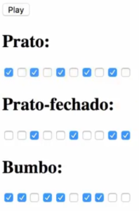

Agora que já entendemos [como dar play em áudio com JS](https://www.devpleno.com/audio-com-js-puro/), [como manipular para compor uma batida](https://www.devpleno.com/beatbox-com-javascript/), faremos com que o usuário escolha a forma como seja tocado, ou seja, um Beatbox Manipulável com JS

 Vamos começar utilizando um pouco da estrutura do HTML usado anteriormente (os áudios importados e o play) e implementar esse código. Criaremos um div.
 
  A ideia é ter vários checkbox para cada instrumento, por exemplo, temos um prato e vários checkbox, os quais podemos marcar. Onde estiver marcado será tocado o áudio e onde não estiver não será tocado. Para não precisarmos criar manualmente todo os inputs, podemos criar um script JS que terá um contador que gera vários checkbox.

```jsx {numberLines: true}
<html>
<head><tittle>beat-box</tittle></head>
<body>
<button id="play">Play</button>

<audio src="prato.wav" id="prato"></audio>
<audio src="prato-fechado.wav" id="prato-fechado"></audio>
<audio src="bumbo.wav" id="bumbo"></audio>
<audio src="boca.wav" id="boca"></audio>
<audio src="caixa.wav" id="caixa"></audio>

<div id="track1" rel="prato">
<h2>Prato</h2>
</div>
<div id="track2" rel="prato-fechado">
<h2>Prato-fechado</h2>
</div>
<div id="track3" rel="bumbo">
<h2>Bumbo</h2>
</div>
<script>
const numItems = 10
function generationTrack(trackId){
const track = document.getElementById('track'+trackId)
for(let i=0; i<10; i++){
track.innerHTML += '<input type="checkbox id="i-'+trackId+'-'+i+'" />'
}
}
generateTrack(1)
generateTrack(2)
generateTrack(2)
</script>
</body>
<html>
```

O objetivo é que o usuário possa escolher quando quer que cada item toque, por exemplo, com o bumbo batendo em um ritmo e o prato nos intervalos.  Para que isso aconteça, cada tick da música tem que checar se naquela linha aquele áudio está marcado.

```jsx {numberLines: true}
<script>
//gera o check-box
const numItems = 10
function generationTrack(trackId){
const track = document.getElementById('track'+trackId)
for(let i=0; i<10; i++){
track.innerHTML += '<input type="checkbox id="i-'+trackId+'-'+i+'" />'
}
}
generateTrack(1)
generateTrack(2)
generateTrack(2)
//fim gerar check-box

const bpm = 90
let current = 0
function tick(){
const currentItem = current++ % numItems
console.log(currentItem)
}
setInterval(tick, (60\*1000)/bpm)
</script>
```

  Note que ele está caminhando entre os itens, mas temos que andar entre os tracks e pegar os que vão ser tocados. Para isso vamos implementar o script criando um for com i iniciado em 1 e i menor ou igual a 3, então podemos checar se aquele item em especifico está marcado. Quando for true, daremos play, e por último 'startar' quando apertarmos no play:

```jsx {numberLines: true}
<script>
const bpm = 90
let current = 0
let isPlaying = false
let timer = null
function tick(){
const currentItem = current++ % numItems
for(let i=1; i<=3; i++){
const item = document.getElementById('i-'+i+'-'+currentItem)
const track = document.getElementById('track' +i)
if(item.checked){
const audio = document.getElementById(track.attributes.rel.value)
audio.currentTime = 0
audio.play()
}
}
}
const play = document.getElementById('play')
play.addEventListener('click', function(){
if(isPlaying){
clearInterval(timer)
play.innerHTML = 'Play'
}else{
timer = setInterval(tick, (60\*1000)/bpm)
play.innerHTML = 'Stop'
}
isPlaying = !isPlaying
}
</script>
```

Todo check ativo irá gerar um som e os inativos serão ignorados. No botão, sempre que estiver tocando vai ter o stop e quando tiver parado vai ter play. Assim geramos um beat-box que o usuário escolhe a forma em que vai ser tocado utilizando o checkbox.

Poderíamos transformar esses checkbox em caixinhas e isso deixaria muito mais parecido com softwares como fruitLoops, que são bem simples de criar batidas.
Esse código está bastante flexível, se quisermos colocar mais itens só aumentar o número de itens no ‘numItems’.

Baixe os arquivos de áudio aqui: [download](https://goo.gl/zHKuad) 

 Curta o [DevPleno no Facebook](https://www.facebook.com/devpleno), [inscreva-se no canal](https://www.youtube.com/devplenocom) e não se esqueça de cadastrar seu e-mail para não perder as novidades. Abraço!

  <div class="embed-responsive embed-responsive-16by9"> 
  <iframe class="embed-responsive-item" src="https://www.youtube.com/embed/01iPnENtCiQ/uqRtwdxH9-s" allowfullscreen></iframe>
   </div>
