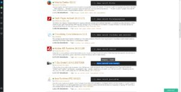
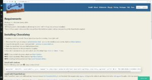

Essa dica é para você utiliza o windows para desenvolvimento: um package manenger chamado chocolatey, semelhante ao yum. Ele facilita bastante quando vamos instalar algumas dependências ou pacotes de software como o NodeJS.

 **Como instalar o chocolatey?** A primeira coisa é entrar em [https://www.chocolatey.org/install](https://www.chocolatey.org/install), rodar o CMD.exe como administrador e copiar esse trecho de código:

```jsx {numberLines: true}
@powershell -NoProfile -ExecutionPolicy Bypass -Command "iex ((New-Object System.Net.WebClient).DownloadString('https://chocolatey.org/install.ps1'))" && SET "PATH=%PATH%;%ALLUSERSPROFILE%\\chocolatey\\bin"
```



 Cole no CMD, dê enter e espere a instalação. Pronto! Agora vamos fazer um teste para instalar alguma dependência. 
 Note que no site há uma aba Packeges, nele temos todos os pacotes disponíveis para instalação. Vamos tentar instalar o 7zip. Selecione a linha de código referente ao programa e cole no CMD:

```jsx {numberLines: true}
choco install 7zip.install
```


Aparecerá uma mensagem para aceitar as licenças do pacote e, em seguida, que o pacote foi aprovado. Então perguntará se quer rodar o script, aperte Y para continuar. Pronto, o 7Zip está instalado na sua máquina.

Este é um utilitário muito interessante, pois podemos instalar Java, NodeJS, Python… Tudo a partir desse gerador de dependência. Facilita bastante para nós que sempre temos que ficar instalando algumas coisas no ambiente de desenvolvimento.

Confira os passos no vídeo:

 Confira os passos no vídeo
 
  Curta o [DevPleno no Facebook](https://www.facebook.com/devpleno), [inscreva-se no canal](https://www.youtube.com/devplenocom) e não se esqueça de cadastrar seu e-mail para não perder as novidades. Abraço!


 <div class="embed-responsive embed-responsive-16by9">
  <iframe class="embed-responsive-item" src="https://www.youtube.com/embed/RfbgCBCWME8" allowfullscreen>
  </iframe> </div>