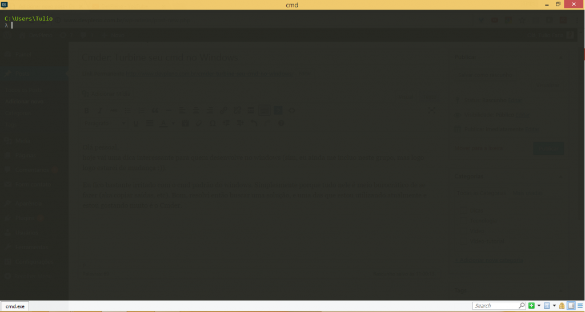

Olá pessoal,
hoje vai uma dica interessante para quem desenvolve no windows (sim, eu ainda me incluo neste grupo, mas logo logo estarei de mudança :)).

Eu fico bastante irritado com o cmd padrão do windows. Simplesmente porque tudo nele é meio burocrático de se fazer (aka copiar saídas, etc). Bom, resolvi então buscar uma solução, e uma das que estou utilizando atualmente e estou gostando muito é o Cmder.

Bom, começando pela interface:

Achei muito bacana esse efeito translucido, mas além de ser só um corpinho bonito, ele realmente é muito funcional e ajuda bastante na produtividade. Alguns pontos que já me chamaram a atenção:

1 – Várias abas
Basta utilizar o atalho: Shif+Alt+1 para adicionar uma aba do CMD, ou Shit+Alt+2 para uma do PowerShell. Ah, e elas ficam todas organizadinhas na parte de baixo da interface (quem já teve que lidar com um zilhão de cmd´s abertos ao mesmo tempo no windows sabe como isso é um grande avanço).

2 – Copiar e colar
Copiar e colar no cmd padrão é bem complicadinho. Você não consegue selecionar o texto diretamente. Já no cmder basta selecionar o texto que você quer que ele já copia. Se quiser colar, basta clicar com o botão direito do mouse.

3 – Cmd on esteroids
O cmder utiliza um “enhancer” para ampliar os comandos disponíveis no shell. Inclusive com SSH, CURL, VI e grep 🙂

4 – Isso é só o começo
Recomendo vocês a entrarem nas preferências do Cmder (clicando no title com o botão direito) ou pressionando win+alt+p, e o personalizar ainda mais (aumentar a fonte entre outros). É possível também configurar como novas abas serão abertas. Vale a pena explorar 🙂

Eu explorei alguns destes itens, porém, só com o básico já ganhei bastante produtividade, acredito que vocês também ganharão. Até a próxima dica 😉