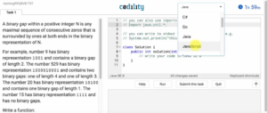
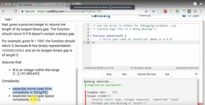

O Codility é uma plataforma que pode ser utilizada para treinar programação e, no caso de recrutadores, para selecionar programadores para a equipe. No meu caso. utilizei o Codility para passar em uma das provas da Toptal e já aproveitei para estudar um pouco mais sobre programação.

 
**Vamos ao hands-on**
Depois de logado no Codility, já caímos em Codility Programers, que é o ambiente para programadores. Na parte superior, temos duas abas: as Lessons e os Challenges. Lessons são as lições que ele tem sobre assuntos de programação, conceitos básicos como iterações, vetores, etc. Já Challenges, são ‘competições’ que podemos participar. Ele é um ambiente completo. Conseguimos rodar baseados nas entradas, desenvolver normalmente utilizando a ferramenta.

**Como me preparei para a Toptal?**
Fui em lessons e fiz tudo que tinha para fazer, deixando tudo em 100%. Eu gosto de fazer na minha máquina depois submeter a solução, mas é possível fazer diretamente no Codility.

Vamos fazer um exemplo. Vou entrar em Iterations e dar o Start na lição. Vai aparecer a mensagem que eu tenho 120 minutos para concluir. Ao começar, é possível mudar de linguagem na aba superior.

 

O problema vem escrito do lado esquerdo e temos que resolver do lado direito. Ele já cria uma função solução.

Conseguimos dar um run para fazermos alguns casos de teste que rodarmos diretamente pelo Codility. Temos também o submit this task, aí sim ele vai passar por todos os processos de qualidade. É preciso ficar atento ao fato de que o Codility considera a complexidade. Na lesson escolhida, por exemplo, ele espera que o pior cenário a complexidade seja O(log(N));

Ele não consegue fazer isso igual fazemos manualmente, ele tem uma estimativa de qual o custo desse algoritmo, ou seja, uma estimativa baseada no que ele percebe que você definiu de variáveis por causa da complexidade de espaço e, no caso de tempo, mede o tempo, então isso pode variar bastante. Isso é bom para ficarmos atentos para reduzirmos esse tempo de consumo, tanto de processador quanto de memória. Também em lessons, temos os materiais para ler e entender o assunto daquela lição especifica. É recomendável ler os materiais também, pois muita das técnicas computacionais mostradas ali são interessantes para relembrar.

 
O Codility é tão simples quanto isso que eu mostrei. Quando você for fazer uma prova, alguém vai te mandar um link, você vai clicar e cair em uma prova específica da empresa, então ele escolhe a dificuldade das questões e define o tempo da prova inteira ou para cada questão.

Confira o vídeo

 Curta o [DevPleno no Facebook](https://www.facebook.com/devpleno), [inscreva-se no canal](https://www.youtube.com/devplenocom) e não se esqueça de cadastrar seu e-mail para não perder as novidades. Abraço!

 <iframe class="embed-responsive-item" src="https://www.youtube.com/embed/xbJ-ZAVL\_vM" allowfullscreen></iframe>
  
