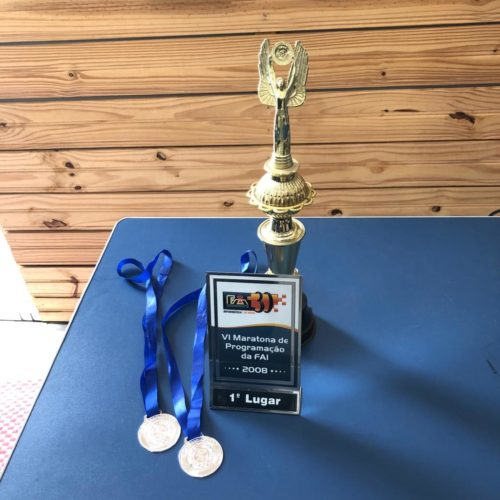
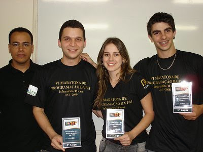
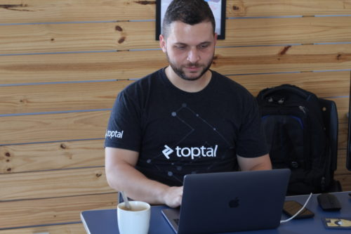

A história do post de hoje já tem mais de 10 anos e faz parte de lembranças que eu tenho de quando ainda estava na faculdade, mais precisamente, de quando participava das maratonas de programação, onde me graduei. E fique comigo até o fim, pois a lição aqui não é só baseada nos prêmios e competição, mas tem total relação a minha aprovação na Toptal.

Esses são prêmios que ganhei participando das competições de programação. Apesar de simbólicos, eles não estão aqui para me gabar ou algo assim, mas claro, eles representam muito para mim e para o meu crescimento profissional e carregam histórias e lembranças da minha evolução como dev.

Na época foi gratificante, por exemplo, em uma competição onde havia alunos de todos os períodos, ter ficado em primeiro lugar mesmo competindo com o pessoal prestes a se formar (que além de mais experiência, já tinham participado das semi-finais nacionais da mesma competição).

No segundo ano de competição, como eu havia vencido no primeiro ano de faculdade, fui com a mentalidade de “já ganhei”. Bom, e aí vem mais uma lição: aprender que nem sempre vencemos. Sim, no meu segundo, fiquei em segundo lugar.

Ainda tinha mais 2 anos de competição, dava para vencer mais 2. Sim, sou muito competitivo e isso não é errado se você não deixar a competitividade passar por cima da sua ética.

Vamos para terceira vez competindo e… Caramba! Ficamos em segundo de novo! E a mesma equipe que havia nos desbancado no ano anterior venceu novamente. O que mais me chocava era que eles venceram sempre utilizando Pascal (perdemos realizando tudo em C puro).

Antes de ir para a minha última competição, refleti sobre o que eu tinha feito de diferente no primeiro ano e que não fiz nos outros 2 e também sobre como perdemos.

No quesito preparação, foi basicamente a mesma coisa, sempre me preparei. Fiz um aquecimento resolvendo vários problemas semelhantes nas semanas que antecederam a competição…

Mas havia algo a mais. Foi aí que lembrei que perdíamos por tempo e não por assertividade. Em maratonas de competição, o primeiro critério é o número de problemas resolvidos: quem resolve mais, vence e em caso de empate, quem os resolve mais rápido. Reparei que como a outra equipe entregava muito rápido (sim, os caras eram muito rápidos em Pascal e eram bem assertivos), tínhamos que vencer de outra forma: na quantidade.

Na minha última participação, faltando 30 minutos para acabar a competição, estávamos perdendo de novo – por tempo. Mesmo número de problemas resolvidos, porém, a equipe Pascal era rápida, tsc.

Restavam problemas cabeludos para resolver… Bom, dá para imaginar que fiquei nervoso e ansioso, mas foquei em fazer passar mais uma solução de problema. Tenta que tenta que tenta… Passamos! \o/

Caramba! Que alívio! Agora, era esperar que o Pascal Team não fizesse mais um – pois perderíamos no desempate por tempo. Lembro que fui embora da sala de competição e brinquei com a equipe do Pascal: “Agora é com vocês”.

É, desta vez foi! Vencemos! Conseguimos encerrar a graduação com mais uma vitória. 🙂

**Algumas lições que tirei durante os quatro anos de competição**
O que mais aprendi durante a minha última vez competindo foi: precisamos repetir o que dá certo e mudar o que não dá. Parece simples, mas na prática é um pouco mais complicado.

Outro ponto importante: como manter a cabeça no lugar sob pressão. Daqueles 30 minutos finais, 20 passaram como se fosse 1 segundo (até que conseguimos resolver o problema). já os 10 minutos esperando, na ansiedade para descobrir se a outra equipe conseguiria resolver, pareciam dias. Isso me ensinou na prática como controlar o máximo que dava meu emocional.

Mas agora vem uma parte mais importante de toda essa história: a competição foi muito legal, ser premiado melhor ainda. Porém, naquele momento, eu não sabia o quanto ter vivenciado tudo isso teria de impacto na minha carreira.

**Como as maratonas de programação da faculdade me ajudaram a prosperar na carreira de Dev**
Muitas vezes, os alunos ignoram atividades extracurriculares durante a faculdade e não dão a importância que elas realmente merecem. No meu caso, foi justamente nessas maratonas que eu passei a treinar programação e, sem dúvidas, isso fez toda a diferença na minha carreira e impactou (positivamente) na criação do DevPleno.

Quase 9 anos depois, fui participar do processo seletivo da Toptal, e adivinhem: em uma das fases (por sinal uma das que mais reprovam) o objetivo era resolver o máximo de problemas em 1 hora. Além do formato parecer muito com a maratona de programação, os tipos de problemas também eram bem semelhantes… Eu já tinha feito isso antes! 🙂

E deu certo! Não passei de primeira – e está tudo bem. Mas o melhor foi que, mesmo não tendo passando de primeira, a mentalidade já vinha sendo preparada para conseguir passar na segunda tentativa.

**Aproveite as oportunidades**
Mais importante do que ter oportunidades é saber aproveitar cada uma delas ao máximo. Às vezes, estamos com a “faca e o queijo na mão” e não enxergamos o quão preciosas são as chances que aparecem na nossa vida.

Por isso, agarre cada oportunidade que surgir na sua vida, seja na faculdade, no trabalho, nas viagens, nos estudos… Veja cada momento como uma chance de se dedicar e explorar os conhecimentos ao máximo. Isso pode te levar a outro patamar e com certeza vai te fazer crescer. Muito.

Talvez não agora… Talvez daqui 10 ou 20 anos, mas a semente vai estar plantada. Aproveite!

 

Ps 1: Aqui fiz uma brincadeira sobre utilizar Pascal, mas é notório que toda linguagem bem utilizada traz resultados.

PS 2: Nas competições que citei, eu não estava sozinho. Obrigado aos meus amigos Luana Lima e Herick Ferreira, pela companhia na equipe Bender. Nós fizemos um ótimo trabalho em equipe.

PS 3:Obrigado, professor Roberto Porto, pelo apoio e incentivo às competições.

PS 4: Na segunda foto, Roberto Porto, eu, Luana Lima e Herick Ferreira.