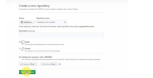
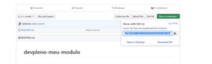
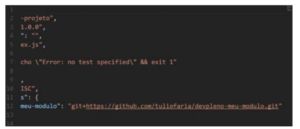

Hoje quero mostrar um recurso que nós temos na ferramenta NPM e que poucas pessoas sabem que existem. Com ela, podemos criar nossos próprios módulos sem precisar registrar no repositório do NPM.

Uma coisa interessante do yarn e NPM é que podemos colocar como dependência do nosso projeto um repositório GIT, inclusive um commit específico ou tag especifica.

Qual a vantagem dessa situação?

Muita gente não utiliza reaproveitamento de código, nem cria seus próprios módulos e bibliotecas porque não tem como compartilhar isso de forma privada. Aqui vamos fazer um exemplo utilizando o repositório do Github.

Nós poderíamos utilizar um repositório privado desde que, na máquina que estiver utilizando, esse repositório tivéssemos uma chave para baixar essa dependência.

Para simplificar esse processo, vou criar um repositório novo e deixar inicializando com o READEME e dar um create repository:

 
 
  Ele vai conter meu código e que vai ser compartilhado com outros projetos. Primeiramente vamos copiar o link que ele nos gera: 
  
  

Vamos agora clonar na máquina. Como ela já está com o tortoise git e a chave atrelada, então eu consigo dar um ok e ele já baixa.

Agora eu posso ir para minha pasta e dar um NPM init nessa pasta para iniciar meu módulo.

Com o package.json aberto, o mais importante é o arquivo main, ele é o que vai ser nosso arquivo principal, ou seja, o ponto de entrada do nosso módulo.

Vamos criar então um index.js e exportar uma função que retorna uma string:

```jsx {numberLines: true}
module.exports = function(str){

return str + ' - DevPleno!'

}
```

Agora vamos dar um commit e push. Se formos agora em meu repositório, ele já vai estar lá. Nós podemos utilizar a URL do repositório como dependência do projeto. Para isso, vamos voltar um diretório e criar um novo diretório 'meuprojeto', acessamos ele e damos um npm init, em seguida um install passando o link do github:

```jsx {numberLines: true}
npm install --save pasteLink
```



 Ela já traz a url com https. Em uma próxima aula vamos criar um repositório e publicar no NPM. Primeiramente queria apenas mostrar que podemos publicar um módulo sem ser pelo npm. 

 Deixe suas dúvidas e sugestões nos comentários. Curta o [DevPleno no Facebook](http://www.facebook.com/devpleno), se inscreva no [canal no YouTube](https://www.youtube.com/channel/UC07JWf9A0B1scApbS1Te7Ww) e cadastre seu e-mail para não perder as atualizações. Abraço!


<div class="embed-responsive embed-responsive-16by9"> 
<iframe class="embed-responsive-item" src="https://www.youtube.com/embed/t24_DGvUa30" allowfullscreen></iframe> 
</div>