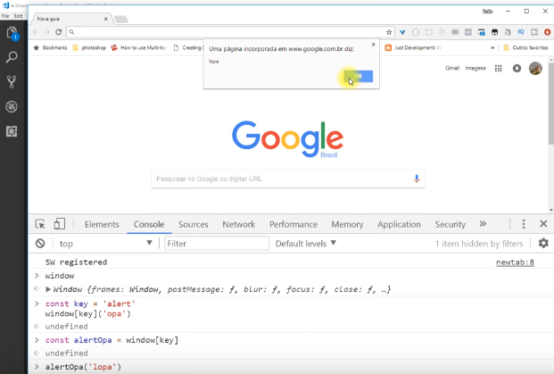

Em programação, blocos de código que executam instruções específicas são chamadas de funções e, no Javascript, são conhecidas como métodos. Agora, imagine o seguinte cenário: como desenvolvedor, você não conhece o nome do método que quer chamar mas sabe que existe o nome dele em uma variável. Então, como faremos para chamá-lo?

Os métodos são muito úteis em casos onde queremos uma programação mais dinâmica, por exemplo: você tem um serviço e não sabe os nomes dos métodos disponíveis e é possível programar a forma como serão chamados ou se você tem uma forma de integrar módulos com pontos de entrada na aplicação para importar o módulo baseado nessa variável, chamando seus métodos dinamicamente.

Imagine o seguinte cenário em temos um console como o da imagem abaixo, onde deixamos para o usuário a opção de escolher o método **log** ou o **debug**:

Ao executarmos o código acima (dinamicamente.js) no prompt de comando, vemos o resultado a seguir com destaque para o “opa” que foi impresso:

Ao criar um objeto obj, definindo valores para suas variáveis a e b, tal qual a imagem abaixo:

Podemos pegar o valor da variável a do objeto obj com a instrução console.log(obj.a) e mostrar o conteúdo de a como um resultado:

Outra forma de obter o valor de a consiste em definirmos uma constante (variável com valor fixo) que chamaremos de key e com a instrução console.log(obj[key]) conseguimos o valor de a como resultado:

Com os métodos, o processo é semelhante. Alteremos o código acima para deixar apenas a definição da constante key como ‘log’ e, como não sabemos a posição do método que iremos chamar, colocamos console[key].

Para entender o que console[key] retornaria, escreveremos a instrução console.log(console[key]) para observar o valor de retorno:

Pelo resultado, notamos uma coisa muito legal no Javascript: as funções também são valores – o que nos permite escrever console[key](‘valor1’) e obter seu resultado no prompt:

O resultado anterior permite que façamos coisas como imprimir com console[key](‘valor’), a partir de um vetor de constantes key, o valor associado a cada constante:

Modificando a definição de const keys, podemos obter todos os métodos de console: 

ou então passar a constante key como um valor:

Se você seguiu os passos até aqui, então conseguiu chamar métodos de uma forma dinâmica – algo muito poderoso no Javascript. Outra coisa que podemos fazer está no Web Console do navegador (Ctrl+Shift+I no Google Chrome). Nesse console, temos um objeto chamado window que traz as mesmas funcionalidades para chamada dinâmica de métodos, assim como fizemos com **console**, vide o exemplo abaixo:

E assim, surge uma mensagem “opa” na tela do navegador:

Podemos, ainda, guardar uma função dentro de uma constante alertOpa:

E, ao acessarmos alertOpa como um objeto, faremos a chamada da função com o texto ‘lopa’ que escrevemos como valor:

A principal ideia do que aprendemos é criar funções dinâmicas e facilitar o uso de módulos de extensões de uma aplicação com essa abordagem, tanto para carregar um módulo dinâmico quanto para executar algo dentro desse módulo dinamicamente.

E essa é a dica de hoje. Confira o passo a passo no vídeo abaixo.

 <iframe class="embed-responsive-item" src="https://www.youtube.com/embed/c6C5j1_Xwig" allowfullscreen></iframe>
  

Até a próxima! 