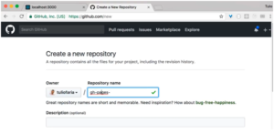
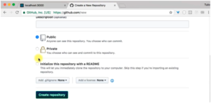
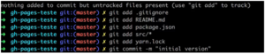
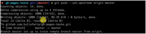
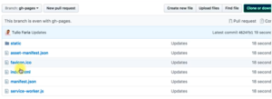

Hoje quero mostrar para vocês como a gente pode postar o nosso site no GitHub utilizando o GH-Pages, sem precisar trocar ou fazer qualquer trâmite com o Git, tudo isso de uma maneira bastante fácil. Além disso, integrar isso em um WorkFlow ou em um processo junto no Node.

A primeira coisa que vou fazer  é criar um repositório chamado gh-pages-teste só para termos um lugar para testar. Vou deixar de forma pública:




Agora vamos no SHELL e dar um create-react-app apenas para criar uma aplicação em React, que vai ser nosso site. Lembrando que não é necessário ser em React, é apenas para mostrar como a gente poderia criar algo estático e hospedar dentro do GitHub.

Uma coisa bastante interessante: o Git permite que a gente mantenha um site estático, basta colocar os arquivos estáticos dentro de um branch chamado GH-Pages, feito isso ele já vai conseguir manter o nosso site.

Agora vou abrir o visual studio code e vamos trocar apenas o que está escrito no App.js, ao invés de Welcome, vou colocar GH-Pages DevPleno.

Agora um detalhe, se no próprio React dermos um yarn build ou npm run build, ele vai gerar os arquivos compilados dentro do diretório build que já tem nosso site todo, agora temos que colocar esses arquivos dentro do Branch do GH-Pages.

Feito isso vamos dar um git init no shell e adicionar os arquivos, lembrando que já iniciamos o repositório:

  
 
 Vamos também dar um git remote add origin e add o ssh que no meu caso é: 
 
  
 
 Também vamos adicionar o upstream: 
  
 
 Feito isso ele subiu, então temos nosso fonte do master. Agora temos que fazer uma forma de criar um brait novo para colocar o site lá. Para isso vamos fazer o seguinte:
```jsx {numberLines: true}
yarn add --dev gh-pages
```

Estamos instalando esse módulo que consegue fazer isso para nós. Depois de instalado vamos construir o diretório que eu quero colocar os arquivos:

```jsx {numberLines: true}
./node\_modules/.bin/gh-pages -d build
```

Ele já está se conectando ao github. Agora se irmos em branch, podemos visualizar o gh-pages, ao olharmos o conteúdo, é exatamente a pasta que foi definida:  


 Deixe suas dúvidas e sugestões nos comentários. Curta o [DevPleno no Facebook](http://www.facebook.com/devpleno), se inscreva no [canal no YouTube](https://www.youtube.com/channel/UC07JWf9A0B1scApbS1Te7Ww) e cadastre seu e-mail para não perder as atualizações. Abraço!


 <div class="embed-responsive embed-responsive-16by9"> <iframe class="embed-responsive-item" src="https://www.youtube.com/embed/qItPnwBbj2s" allowfullscreen></iframe> </div>