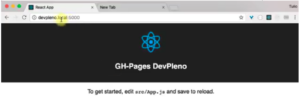

Hoje quero dar uma dica bem rapidinha de como você pode testar o seu site local com domínios válidos para sua máquina. Com isso você consegue, por exemplo, fazer um domínio que você ainda não publicou ou registrou funcionar somente na sua máquina para testes. Outra coisa bastante útil é se você precisa, no seu sistema, lidar com diferentes domínios. É possível fazer essa configuração local na sua máquina para fazer esse teste.

Nós vamos fazer no Mac, mas vou deixar logo o caminho do arquivo para o Linux e para o Windows:

```jsx {numberLines: true}
\- Mac OS: /etc/hosts

- Linux: /etc/hosts

- Windows: c:\\windows\\system32\\drivers\\etc\\hosts
```

Com o Shell aberto vou dar um 'sudo' para fazer algo como super user, como estamos mexendo em uma configuração do sistema operacional, precisamos ser administrador para fazer isso:

```jsx {numberLines: true}
sudo nano/etc/host
```

Você pode perceber que eu já tenho dois servers mapeando para o mesmo IP: 

 

Agora podemos digitar nesse arquivo e adicionar um novo IP e mapear para o site que eu quero, por exemplo:

```jsx {numberLines: true}
127.0.0.1     devpleno.local
```

Eu já tenho uma aplicação para teste rodando no localhost, vamos testar agora mudando o url: 

 

Perceba que ele está mapeando normalmente. Lembrando que isso não vale para máquinas externas. 

 Deixe suas dúvidas e sugestões nos comentários. Curta o [DevPleno no Facebook](http://www.facebook.com/devpleno), se inscreva no [canal no YouTube](https://www.youtube.com/channel/UC07JWf9A0B1scApbS1Te7Ww) e cadastre seu e-mail para não perder as atualizações. Abraço!


<div class="embed-responsive embed-responsive-16by9">
 <iframe class="embed-responsive-item" src="https://www.youtube.com/embed/kh5gLNqxxeM" allowfullscreen></iframe> 
 </div>