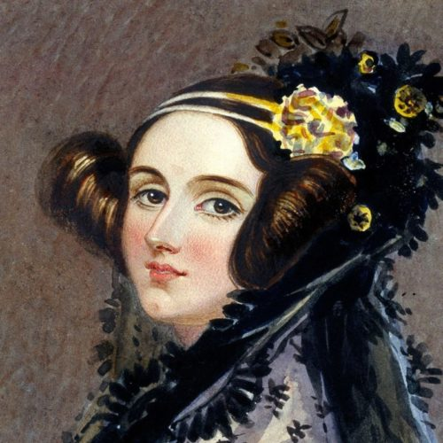
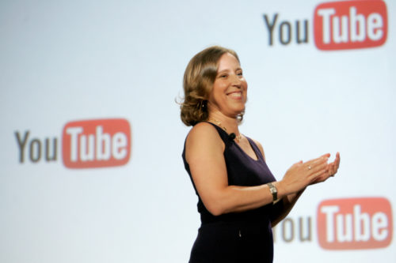
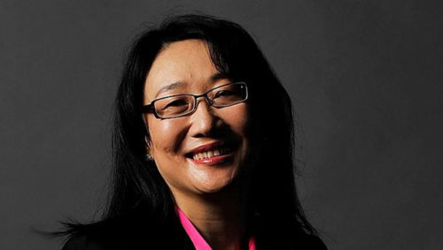
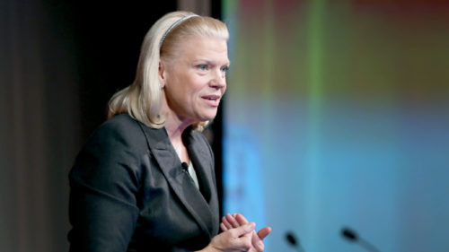
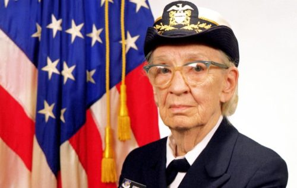

Dia 8 de março é comemorado o Dia Internacional da Mulher. Apesar de não ocuparem majoritariamente os cargos na área de tecnologia da informação, diversas mulheres se destacaram pela maestria ao exercerem suas funções.

Por isso, neste post vou falar um pouco sobre oito mulheres ligadas à area de TI que brilham muito em suas carreiras. Confira:

###1 – Ada Lovelace

Ela foi a primeira mulher a programar na história. Ada era matemática e, ao ajudar o colega, Charles Baggage a desenvolver a primeira máquina de cálculo, Ada foi resposável pela criação do algoritmo que poderia ser usado para calcular funções matemáticas. A máquina analítica de Babbage criada por ela, em conjunto com o colega, foi reconhecida como primeiro modelo de computador.

Ada tem um dia internacional no calendário em sua homenagem: 13 de outubro, conhecido como Ada Lovelace Day. Incrível, não?

**2 – Susan Wojcicki**
Atual diretora do YouTube, Susan também já foi diretora de marketing do Google, inclusive, a empresa iniciou na garagem de sua casa, quando, na época, ela trabalhava em outra empresa.

Posteriormente, Susan também entrou para a equipe do Google e foi responsável por criar produtos extremamente rentáveis para a marca, como, por exemplo, o Google Fotos, o AdSense, o AdWords e o Analytics.

Susan também foi diretamente responsável pela compra do YouTube pelo Google e diversas vezes já apareceu nos rankings de mulheres mais influentes do mundo.

**3 – Cher Wang**
Co-fundadora e presidente da HTC, Cher é taiwanesa, sendo uma das mulheres mais bem-sucedidas da tecnologia. Ela já foi considerada pela revista Forbes a 54ª mulher mais poderosa do mundo. Cher Wang também é conhecida por realizar ações filantrópicas, e já ajudou diversas instituições.

**4 – Ginni Rometty**
Formada em Ciência da Computação e Engenharia Elétrica, Ginni começou sua carreira no General Motors Institute.

Ginni ingressou na IBM no ano de 1981, como engenheira de sistemas. Ginni é a primeira mulher a se tornar CEO da IBM. Antes, Ginny ocupou os cargos de vice-presidente sênior e executiva de vendas, marketing e estratégia.

**5 – Grace Murray Hopper**
Conhecida como a Rainha da Computação (e algumas outras denominações, como Vovó COBOL, a grande dama do Software, rainha da codificação), Grace Murray Hopper foi responsável por inventar o primeiro compilador: um software que funcionava como uma espécie de tradutor entre humanos e computadores.

Formada em matemática e física, Grace entrou para a Marinha em 1943 – durante a guerra – e foi enviada para a Universidade de Harvard, onde trabalhou programando o Mark I, primeiro computador de grande capacidade, mas que na época sua utilidade era somente para fazer cálculos relacionados a guerra.

Anos depois, Grace fez parte da equipe que desenvolveu o primeiro computador comercial fabricado nos Estados Unidos e, então, criou o seu primeiro compilador. Ela ainda desenvolveu a linguagem Flow-Matic (primeira linguagem de programação semelhante ao inglês), da qual surgiu o COBOL (uma lingugagem de programação utilizada no processamento de banco de dados comerciais).

Grace faleceu em 1992. Desde 1994 há um congresso denominado Grace Hopper Celebration, que acontece todos os anos e é destinado para as mulheres da área da tecnologia.

As três últimas, apesar de não serem mundialmente famosas, realizaram palestras com uma abordagem muito interessante e eu particularmente gosto bastante.

**6 – Linda Liukas:**
Linda é uma autora finalndesa de livros infantis, ilustradora e instrutora para programadores iniciantes. Ela ensina, de forma clara e divertida, crianças a programarem.

Vale a pena conferir

  <iframe class="embed-responsive-item" src="https://www.youtube.com/embed/-jRREn6ifEQ" allowfullscreen></iframe>

**7 – Ayah Bdeir:**
Ayah Bdeir é fundador da littleBits e também ensina programação para criança forma criativa: com blocos tão divertidos como LEGO!

Confira:

  <iframe class="embed-responsive-item" src="https://www.youtube.com/embed/YguB-keZ4Tk" allowfullscreen></iframe>

**8 – Anjana Vakil:**
Anjana fala sobre programação funcional com JavaScript, um conceito inovador e muito interessante nos dias atuais.

Assista ao vídeo:

  <iframe class="embed-responsive-item" src="https://www.youtube.com/embed/e-5obm1G_FY" allowfullscreen></iframe>

**Feliz Dia Internacional da Mulher para todas as mulheres!**

O DevPleno deseja um dia especial a todas as mulheres! Gostou do post ou quer acrescentar alguma mulher importante na história da tecnologia que não foi citada no post? Deixe um comentário!