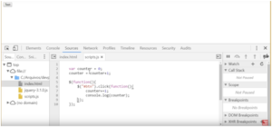
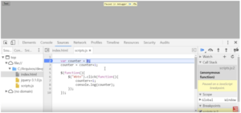
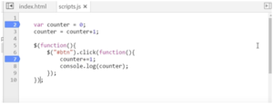

Hoje vou dar uma dica rápida de como podemos fazer o debug de código JavaScript no navegador. É bastante simples, se você já trabalha com Java ou alguma ID, já deve ter uma ideia de como fazer isso na ID.

 Podemos fazer isso também no front-end com JavaScript. Para ilustrar, vamos usar o seguinte código, que apenas inclui o jQuery e fiz um scripts.js:

```jsx {numberLines: true}
<html>

<body>

<button id="btn">Test</button>

<script src="jquery-3.1.0.js"></script>

<script src="scripts.js"></scripts>

</body>

</html>
```

  O script em si tem um contador e duas funções assíncronas:

```jsx {numberLines: true}
var counter = 0 ;

counter = counter+1;

$(function)(){

$("btn").click(function(){

counter+=1;

console.log(counter);

});

});
```

Provavelmente quando você executar esse código no browser ele não vai fazer nada, pois estamos passando um console.log O que fazer?

 No Windows, aperte F12 para abrir o developer tool bar:

  
 
 Uma dica interessante: podemos dar CTRL + e CTRL – dentro da tool bar, com isso ele aumenta e diminui o zoom.

Há vários painéis e no sourse vemos todos nossos arquivos fontes. Nele você escolhe, na barra lateral, qual o arquivo quer visualizar e ele mostrará o código. Também é possível saber o que está acontecendo no script, por exemplo, clicar no número 2 da linha 2, voltar no script e dar F5. Ele pausou para podermos debugar o código.

  
 
 Se passar o mouse em cima da variável, ele mostra que ela não foi definida ainda, se clicar em step over    
 
 ele executa a instrução e passa para a próxima linha. Ao passar o mouse em counter, ele recebeu 0 porque agora foi atribuído o valor a ele.

Uma das coisas que acho fantástico no Chrome é o counter estar com o valor zero. Se eu quiser prever quanto ele vai ficar, posso selecionar o pedaço de código que quero e ele já faz um preview do valor que essa variável vai retornar. Isso é muito bom para quando vamos debugar um código mais extenso. O problema é que quando  continuamos apertando o step over, vai entrar em uma parte de um código jQuery, se eu der um step over de novo, ele irá para dentro desse jQuery, então para evitar isso, eu coloco o meu break point  dentro da função anônima que vai ser chamada de forma assíncrona.

 
 
  Se deixarmos no 7, ele nunca vai fazer nada porque nunca vai passar pelo console.log, então vamos no botão resume   para continuar executando.Ele executou tudo que podia de forma síncrona e como coloquei o break point dentro da função anônima, vamos clicar em test para ver o que acontece. Perceba que agora podemos selecionar e checar o preview normalmente como fizemos anteriormente. 
  
  Esse tipo de debug ajuda muito quando precisamos achar algum erro de lógica, afinal é equivalente a fazer aquela execução passo a passo. Confira o vídeo
  
   Curta o [DevPleno no Facebook](https://www.facebook.com/devpleno), [inscreva-se no canal](https://www.youtube.com/devplenocom) e não se esqueça de cadastrar seu e-mail para não perder as novidades. Abraço!


  <div class="embed-responsive embed-responsive-16by9">
   <iframe class="embed-responsive-item" src="https://www.youtube.com/embed/I6RCJ6BDHz0" allowfullscreen></iframe>
    </div>