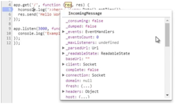

A dica de hoje é sobre como podemos fazer o debug dos nossos scripts em Node (de um script que fica rodando direto como o express e de um script simples) utilizando o chrome. Eu tenho em minha máquina um servidor em express e no meu shell eu vou rodar esse servidor:

```jsx {numberLines: true}
node -- inspect server.js
```

Perceba que ele mostra um link: 

 

Esse link eu vou copiar e colar no navegador. Com isso ele abre para mim o devTools do Chrome e eu posso ir em Source, por exemplo, apertar CTRL+P e colocar o nome do arquivo, no caso o meu se chama servser.js: 

 

Agora eu quero que ele pare a execução quando passar no primeiro console.log: 

 

É muito comum em algumas ferramentas como o visual studio fazer o debug dessa forma, setando um break point e quando o script for executar, ele vai parar nesse ponto que marcamos. 

Agora vamos rodar nosso localhost:3000 e quando voltamos para o devtools, perceba que ele parou e nós conseguimos checar o que tem dentro do req, res: 

 

Eu posso pedir para ele ir para a próxima linha ou mandar continuar o script utilizando os botões: 

![(73aa926e-a947-4d9d-8c54-4f3920ba916b.png) 

Vamos supor que eu queira saber o que vai sair em uma expressão, eu posso selecionar e passar o mouse em cima que ele mostra sendo executado. Isso é muito útil para achar alguma inconsistência no código. 

Sempre que você for testar, principalmente código assíncrono, coloque um break point onde você quer que pare, principalmente para call back. 

Outra forma que temos de depurar um código é depurar desde a primeira linha, para isso vou utilizar um algoritmo que já fizemos em outra aula: 

 

```jsx {numberLines: true}
node --inspect --debug-brk cyclic\_rotation.js
```

Percebam que eu não tenho nada de assíncrono no meu algoritmo, mas mesmo assim ele deu uma URL para depurar:

  
 
 Então vamos colocar essa URL no Chrome e ele já para na primeira linha do meu código executável. Vamos colocar um break point e dar um resume para ver o que acontece: Como é uma função executável ele mostra para mim algo muito semelhante ao teste de mesa que é executar passo a passo o algoritmo. 
 
  
 
 E eu posso também ir passando linha a linha apenas clicando no botão usado anteriormente e ele vai mostrar como está o valor que foi alterado. 
 
 
 
  Com isso nós conseguimos saber exatamente oque está acontecendo no nosso algoritmo, fazer a depuração do script de uma forma mais precisa, ainda mais quando é uma função pura porque conseguimos injetar os valores e ir testando passo a passo. 
  
  Não esqueça de curtir o [DevPleno no Facebook](https://www.facebook.com/devpleno), [inscrever-se no canal](https://www.youtube.com/devplenocom) e cadastrar seu e-mail para não perder nenhuma atualização.


  <div class="embed-responsive embed-responsive-16by9">
   <iframe class="embed-responsive-item" src="https://www.youtube.com/embed/mNTPo\_9FEKU" allowfullscreen></iframe>
    </div>