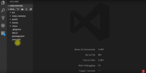

Neste hands-on, vamos falar sobre o Express-Generator, um gerador de projetos em expressJS. Com ele conseguimos criar a base da nossa aplicação. Primeiramente, para instalar o generator, faça o seguinte comando:

```jsx {numberLines: true}
npm install -g express-generator
```

Lembrando que usando o express -h aparece uma lista com algumas opções, o que é muito legal para podermos escolher a linguagem de template que queremos utilizar, como por exemplo --ejs. O default dele é o --pug ou --jade.

 É possível também adicionar um compilador de CSS. Para o exemplo ficar mais completo, vou colocar tudo no projeto. No diretório pai que quero construir minha aplicação, vou colocar:

```jsx {numberLines: true}
dica-express --ejs --git --css sass
```

E em seguida, para instalar as dependencias, vou digitar:

```jsx {numberLines: true}
yarn
```

Feito isso, se dermos um cd dica-express/ acessamos o diretório e com o ls -l podemos ver que temos todo os arquivos com detalhe. Usando o ./ podemos abrir no visual code e ver a estrutura que acabamos de criar com o express-generator: 
 

É interessante, pois a aplicação é construida no app.js e ainda cria uma boa prática, que é exportar o app, e quem vai iniciar esse app (no caso o bin/www) é quem vai definir as portas e etc. 

Qual a vantagem disso? Quando formos criar testes em trend para EPI, por exemplo, podemos importar o app e rodar os testes em cima disso e não necessariamente abrir uma porta. O teste controla isso. Na pasta pub, tem o meu style.sass, que é o meu estilo configurado para SaSS.

 No package.json, já tem alguns scripts para conseguirmos utilizar. Podemos, então, fazer um yarn start para abrir o projeto no browser utilizando o localhost:3000 . Perceba que ele já faz a compilação do SaSS pelo app

var sassMiddleware = require('node-sass-middleware');

Nessa linha de código, já é feito a tradução. Quando ele bate em um js, procura no SaSS e gera automaticamente os styles.css. O Express-Generator já configura tudo para nós. Quando quisermos dar esse bootstraping na aplicação nova, ele nos poupa muito trabalho. Confira a explicação em vídeo

Curta o [DevPleno no Facebook](https://www.facebook.com/devpleno), [inscreva-se no canal](https://www.youtube.com/devplenocom) e não se esqueça de cadastrar seu e-mail para não perder as novidades. Abraço!

<div class="embed-responsive embed-responsive-16by9">
 <iframe class="embed-responsive-item" src="https://www.youtube.com/embed/EykUOF7Ah2Y" allowfullscreen></iframe>
  </div>