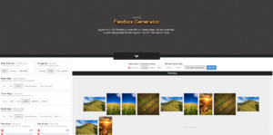
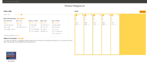

Há um tempo passei por uma situação onde precisava criar algumas coisas com Flexbox (uma nova forma de display do CSS) na parte de layout do react native (já que é feita em flexbox). Para decidir quais atributos vamos utilizar no flexbox, temos algumas ferramentas que podem nos ajudar, e é isso que eu quero mostrar.

 

**Por que ele foi criado?**
O flexbox veio resolver um problema grande que tínhamos de layout, afinal no CSS fazíamos algumas ‘gambiarras’ com float e virava uma bagunça. Ele ‘flexibilizou’ isso, e temos muito a ganhar com a ferramenta.

 

**Apresentando as Ferramentas**

Temos 3 ferramentas, que eu particularmente uso bastante, e com elas fica bem fácil criar um layout. O primeiro é o **Flexys-boxes.**

 

 

Podemos mudar o eixo principal (flex-direction) que por padrão esta row, para outras orientações, como por exemplo, column, e a ferramenta vai simular como vai ser a apresentação.

 

Dentro de cada um dos Box eu consigo mudar também order, align-self e até mesmo o flex. Com isso, nos é apresentada a linha de código CSS com as propriedades sendo atualizada a cada modificação feita. 

Isso é muito legal, pois podemos ir adicionando novos box e ter um preview de como vai ficar e nos ajuda bastante na hora de criar um layout com o flexbox.   A segunda ferramenta é o **Interative Flexbox Generator**.

 [https://loading.io/flexbox/](https://loading.io/flexbox/) 
 
 Nele, já temos um preview de alguns tipos de item, como imagens, blocos ou textos dentro do content in item. 
 
 
 
  Também conseguimos mudar o main direction, assim como no flexys-boxes, visualizar como queremos o Wrapping, main align, cross align, etc. Tudo isso tendo um preview de como será o layout.
  

   E a terceira e ultima ferramenta é o visual **Guide to CSS3 flexbox.** 
   
   [https://demos.scotch.io/visual-guide-to-css3-flexb](https://demos.scotch.io/visual-guide-to-css3-flexbox-flexbox-playground/demos/)
   
   [ox-flexbox-playground/demos/](https://demos.scotch.io/visual-guide-to-css3-flexbox-flexbox-playground/demos/) 
   
   
   
   Nele, podemos mudar a largura de todos os Box, e também modificar dentro de cada Box, mais ou menos como nas outras duas ferramentas.

 

Confira mais detalhes no vídeo:

 
 
 <iframe class="embed-responsive-item" src="https://www.youtube.com/embed/Puz6RHPQ_uM" allowfullscreen></iframe>
  

   Curta o [DevPleno no Facebook](https://www.facebook.com/devpleno), [inscreva-se no canal](https://www.youtube.com/devplenocom) e não se esqueça de cadastrar seu e-mail para não perder as novidades. Abraço!

   
   
