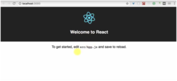
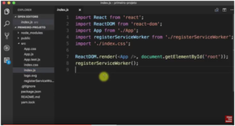
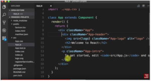
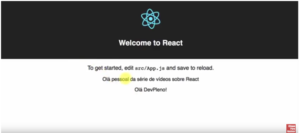

Nesta nova série, vamos construir um aplicativo na prática, mais especificamente um gerenciador de séries, para você nunca mais esquecer as séries que assistiu no Netflix e também as que você tem para assistir que algum amigo te indicou. Para isso, vamos utilizar o ReactJS, a tecnologia que eu utilizo no meu dia a dia nos projetos para uma empresa americana e nos que a minha empresa desenvolve. É um potencial muito grande para o mercado conhecer e saber desenvolver projetos com o ReactJS.

Atualmente dizemos que o ReactJS é unanimidade em todos os lugares, pois podemos desenvolver para WEB, aplicativos nativos para celular, Windows… basicamente tudo. Por esse motivo, está muito em alta e é importante aprender essa biblioteca neste momento.

Hoje vamos preparar a máquina para criar o projeto, configurando como vamos armazenar esses dados para podemos fazer as quatro operações que são inserir um registro novo nesse banco, retornar esses registros do banco, atualizá-los e excluir os registros.

No fim disso, vamos fazer um primeiro projetinho para que você saiba como é um componente em React, ver funcionando e falar um pouco sobre JSX, que é a linguagem que o React usa para conseguir manipular as coisas na tela. Nas próximas aulas, vamos começar realmente a construir essa aplicação com navegação e tudo mais. Outro ponto legal é que você pode utilizar essa aplicação como portfólio.

VAMOS LÁ!

Para construir esse projeto, vamos precisar de  três módulos:

```jsx {numberLines: true}
npm install -g json-server
npm install -g create-react-app
npm install -g yarn
```

O Create React App é uma forma de iniciar o projeto em React de forma muito rápida e sem ‘briga’, afinal, quando temos que configurar muito webpack, gastamos muito tempo porque dá muito problema, então o Create React App já é uma forma muito boa de começarmos um projeto, pois diminuímos muito o número de dependências diretas do projeto deixando ele mais limpo.

Já o Yarn é bom instalar porque o Create React-App usa muito o Yarn, que é uma NPM com mais coisas, isso faz com que o Create React-App rode mais rápido.

Depois podemos criar realmente nosso projeto:

```jsx {numberLines: true}
create-react-app primeiro-projeto
```

Perceba que ele está instalando o React, react-dom, and react-scripts. Quando criamos um projeto com o Create React-App, ele coloca dependência apenas para esses três módulos, isso deixa o projeto mais leve e fica mais claro quais dependências estamos colocando.

Com isso, ele vai criar dentro do diretório ‘primeiro-projeto’ e vamos acessar  esse diretório utilizando cd e depois startando o yarn:

```jsx {numberLines: true}
cd primeiro-projeto/
yarn start
```

ele irá abrir o projeto: Se você conseguiu acessar, tem um projeto em React funcionando. Vou parar o servidor um pouco e fazer o seguinte:



```jsx {numberLines: true}
code./
```

Ele vai abrir o Visual Studio Code com esse diretório aberto. Note que ao criar nosso primeiro projeto, ele já criou algumas coisas como o package.json e dentro dele as dependências são muito curtas.

Vamos entrar em index, já que ele é nosso ponto de entrada, ele instancia um componente chamado app e renderiza isso no elemento root que está em public/index.html.

 
 
Ele irá trocar esse div root pelo componente app. Falando em componente, o React usa componentes como sua base mínima de código.

**O que é um componente?**

Um componente no React é uma junção de um ‘template’ mais um pouco de comportamento e, dependendo de como organizamos isso, podemos ter mais ou menos elementos. Essa forma de utilizar componentes permite uma reutilização de códigos muito grande. Por exemplo, se abrir o app.js, você vai perceber que há um class app extends component, que é do próprio React que estamos estendendo.

Também é possível perceber que temos um método Render que renderiza algo na tela. Temos como se fosse um HTML:


 
Esse HTML, na verdade, não é HTML, é o que chamamos de JSX.

**O que é o JSX?**

É uma forma que o React achou para representar elementos ou hierarquia de elementos em JavaScript de uma maneira que pareça HTML. Com isso, ao invés de criarmos uma árvore de elementos em JavaScript, que seria algo muito complexo, eles criaram uma anotação que com algo semelhante a HTML e transforma isso depois em código quando precisa ser renderizado na tela. Quando ele percebe que tem um div, o react-dom ele transforma em HTML, mas o className continua, pois é uma palavra reservada do JavaScript.

Voltando ao App, temos algumas regrinhas: a primeira delas é que o render, que é o método responsável pelo que vai ser renderizado na tela, sempre retorna um elemento, por isso temos uma div que começa e é fechado mais abaixo. A segunda coisa importante é que quando o elemento começa com letra minúscula, ele já sabe que esse elemento é uma Tag do HTML, como por exemplo o div e o img, já se usarmos letra maiúscula ele sabe que é um componente. Outro item importante, perceba que importamos o React e o Componente, mas não os utilizamos explicitamente, eles vão ser utilizados na hora que tivermos escrevendo JSX.

Vamos criar um componente agora para você ter essa ideia de como é criado, por exemplo Ola.js.

A primeira coisa é importar o React e o componente, depois vamos criar a classe estendendo o componente, lembrando que todo componente deve ter um render, que deve retornar algo:

```jsx {numberLines: true}
import React, {Component} from 'react'

class Ola extends Component{
  render(){
    return (<span>Olá DevPleno!</span>)
  }
}
export default Ola
```

Esse componente está preso ali, temos que avisar o 'mundo externo' que esse componente existe para podemos utilizá-lo, por isso utilizamos o export. Agora dentro de app.js, por exemplo, podemos fazer o seguinte:

```jsx {numberLines: true}
import Ola from './Ola'
```

Podemos depois colocar no final:

```jsx {numberLines: true}
<Ola></Ola>
```

e o resultado é o seguinte:  

 

Acabamos de criar um componente. Outra coisa importante é que conseguimos injetar dados, como por exemplo:

```jsx {numberLines: true}
<Ola name='Tulio' />
```

E dentro do Ola.js fazer o seguinte:

```jsx {numberLines: true}
import React, {Component} from 'react'
class Ola extends Component{
  render(){
    return (<span>Olá {this.props.name}!</span>)
  }
}
export default Ola
```

Essa é uma forma de enviar dados do componente pai para o filho, afinal estamos passando propriedades (ou props) para o componente.

Durante a execução do projeto que vamos fazer, utilizaremos bastante isso.

Por fim, vou mostrar como vamos criar o banco de dados que vamos utilizar com o Json Server. Vou criar dentro de src mesmo, apenas para teste, chamado db.json.

Esse db.json vai ter o seguinte formato:

```jsx {numberLines: true}
{
"series":\[
{
"id": 1,
"name": "How I met your mother"
},
{
"id": 2,
"name": "Friends"
}

\]

}
```

Vamos salvar e dentro do diretório colocar

```jsx {numberLines: true}
json-server --watch db.json
```

Com isso, temos um resource Séries dentro do nosso localhost. Então, se acessarmos o código via browser, temos acesso ao Json preparado para podermos assumir dentro da aplicação, apenas utilizando a url.

Curta o [DevPleno no Facebook](https://www.facebook.com/devpleno), [inscreva-se no canal](https://www.youtube.com/devplenocom) e não se esqueça de cadastrar seu e-mail para não perder as novidades. Abraço!

 
<div class="embed-responsive embed-responsive-16by9">
 <iframe class="embed-responsive-item" src="https://www.youtube.com/embed/Ckp23FEAVQ8" allowfullscreen></iframe>
  </div>