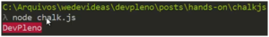

O ChalkJS é um módulo que basicamente permite uma saída colorida no console. Primeiramente vamos importar o módulo:

```jsx {numberLines: true}
yarn add chalk
```

Agora, no editor, vamos escrever um código. Eu criei um arquivo chalk.js e dentro dele vamos colocar o seguinte:

```jsx {numberLines: true}
const chalk = require('chalk')

console.log('DevPleno')
```

Ao mandarmos rodar o código, a resposta sairá normalmente, mas agora vamos utilizar de uma forma diferente:

```jsx {numberLines: true}
console.log(chalk.red('DevPleno'))
```

Agora, se rodarmos o código, ele vira da seguinte forma: 

 

O interessante é que podemos combinar as seguintes variações:

 

Ao aparecer um erro ou um alerta, por exemplo, podemos colocar um 'bgRed': 



Uma outra coisa interessante é que podemos abrir o estilo, por exemplo:

```jsx {numberLines: true}
console.log(chalk.styles.red.open+'Vermelho'+chalk.style.red.close)
```


Então podemos estilizar todos os console.log que tiverem entre o open e o close, isso é muito legal, pois podemos, por exemplo, printar uma mensagem em vermelho que é grande, podemos dar só um open e um close. Vale muito a pena dar uma olhada na documentação até para saber quais são os parâmetros que ele aceita.   

<div class="embed-responsive embed-responsive-16by9 mb-4">
  <iframe class="embed-responsive-item" src="https://www.youtube.com/embed/-ikx1d25Efw" allowfullscreen></iframe>
</div>

Deixe suas dúvidas e sugestões nos comentários. Curta o [DevPleno no Facebook](http://www.facebook.com/devpleno), se inscreva no [canal no YouTube](https://www.youtube.com/channel/UC07JWf9A0B1scApbS1Te7Ww) e cadastre seu e-mail para não perder as atualizações. Abraço!