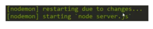

---
Neste hands-on, vamos falar mais especificamente sobre o Nodemon.  Primeiramente vamos instalar:

```jsx {numberLines: true}
npm install -g nodemon
```

Eu poderia instalar localmente também apenas tirando o -g, assim ele não ficaria disponível no sistema inteiro. Mas, o que o nodemon faz? 

Ele permite que a gente rode um script em node e que ele fique monitorando os arquivos. Caso você altere, ele restarta automaticamente o servidor, isso é muito interessante principalmente quando vamos fazer algo com o express. Eu tenho um server.js:

```jsx {numberLines: true}
const express = require('express');

const = express();
app.get('/', function (req, res){
    console.log('>> here...' +new Date().getTime())
    res.send('Hello World');
})
app.listen(3000, function() {
    console.log('Example app listening on port 3000!');
});
```

Caso eu modifique alguma linha, por exemplo:

```jsx {numberLines: true}
console.log('Example app listening on port 3000!\*\*\*\*');
```

Ele restarta o server e já me diz o server foi reiniciado devido a mudanças: 

 

Vamos supor que por algum motivo eu não quero alguns arquivos, então eu posso fazer ele ignorar esses arquivos. Vou fazer o teste na pasta lib:

```js
nodemon --ignore lib/ server.js
```

Assim nada que modificarmos dentro dessa pasta vai fazer o server ser restartado. 

Outra coisa interessante é que se digitarmos rs e dermos um enter, conseguimos forçar um restart dele também.

Essa ferramenta ajuda bastante a agilizar o processo de desenvolvimento recarregando os arquivos sempre que precisarmos. Tem outras opções, por exemplo, conseguimos criar um arquivo de configuração, mas se usarmos apenas para restartar o servidor, já é muito útil e aumenta muito a produtividade.

Confira o vídeo:

<div class="embed-responsive embed-responsive-16by9 mb-4">
  <iframe class="embed-responsive-item" src="https://www.youtube.com/embed/iZpvJm6Oq6I" allowfullscreen></iframe>
</div>

Curta o [DevPleno no Facebook](https://www.facebook.com/devpleno), [inscreva-se no canal](https://www.youtube.com/devplenocom) e não se esqueça de cadastrar seu e-mail para não perder as novidades. Abraço!