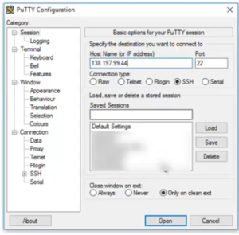
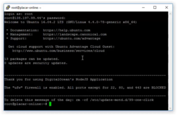
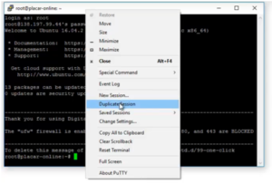

O PuTTY é um software que nos permite conectar tanto em Tellnet quanto em Rlogin, SSH, etc. Na verdade, eu uso mais para gerenciar servidores com SSH e vou mostrar alguns macetes dele. 

Eu tenho um IP em uma máquina no Digital Ocean, vou copiar o IP dela e dar um Open:

 
Ao rodar, vamos colocar o login e senha:
  
 

   
Ele está conectado ao SSH. O único problema é que ele roda apenas no Windows. No MAC, conseguimos conectar diretamente, então não precisamos necessáriamente conectar pelo PuTTy, podemos usar o Shell que está tudo bem.

Uma coisa legal é que se selecionar algum texto dentro do PuTTy, ir em um bloco de notas e dar um CTRL+V ele vai copiar o texto.

Outra coisa interessante é que, se quiser copiar um texto, basta dar um CTRL+C e no PuTTy apertar com o botão direito do mouse, isso ajuda muito porque o CTRL+V não funciona.

Toda vez que estamos com uma sessão aberta, podemos clicar com o botão direito e duplicar essa sessão: 

Assim, conseguimos abrir uma outra conexão com essa mesma configuração ou ainda dar um New Session e conectar em um outro servidor.
Quando for conectar em um servidor, é sempre bom usar o UTF-8.

Às vezes, no Windows, ele troca para o CP866 e isso faz com que os caracteres apareçam diferentes.

Também podemos gravar as sessions na aba Session, colocando o nome de usuário para caso formos conectar com chave e o ip, por exemplo, root@138.197.99.44. Em name, colocar o nome que vai ser do servidor Uma coisa que eu costumo fazer bastante principalmente em máquinas na WS ou alguma máquina que necessite autenticação: Além de marcar a sessão, posso ir em SSH/Auth e carregar a minha chave privada para conectar com a chave.
O PuTTy é extramente pequeno e antigo, um software que conheço há muito tempo e ainda continua funcional da mesma forma. É possível baixar um software de complemento dele, o PuTTy Gen, que gera chaves privadas. Em um próximo hand-on falaremos um pouco mais sobre ele.

Confira:
    

  <iframe class="embed-responsive-item" src="https://www.youtube.com/embed/uir99Vt8Z8c" allowfullscreen></iframe>

    

         
    
    

    
   

