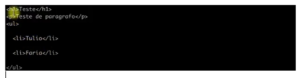

Hoje quero mostrar como podemos utilizar os Templates Engines, que já temos no Express como EJS, PUG, etc, para gerar arquivos HTML estáticos. Com esse processo, conseguimos fazer um gerador de site estático tranquilamente. Obviamente já existem alguns sistemas que fazem isso, mas quero mostrar que também é possível utilizando somente essas linguagens de template. Eu já tenho um diretório criado, vou utilizar o EJS por ser mais parecido com JavaScript e fica mais fácil de utilizar:

```jsx {numberLines: true}
yarn add ejs
```

Feito isso, vamos criar um arquivo novo index.js. A ideia é criar um template de teste. Vamos supor que ele tenha o seguinte:

```jsx {numberLines: true}
<h1>Teste</h1>
<p>Teste de paragrafo</p>
```

Então, se eu colocar uma variável, como uma lista, eu posso fazer essa lista baseado em valores que eu mandei do meu script. A maneira mais comum de se utilizar o EJS é plugado-o dentro do express, porém nós também conseguimos utilizá-lo de forma independente, assim podemos simplesmente importar o EJS e, de alguma forma, dar um render nele:

```jsx {numberLines: true}
const ejs = require('ejs')
const html = ejs.render('<h1><%= teste %></h1> ', {teste: 1234})
console.log(html)
```

Se rodarmos isso, nós temos o nosso html. Nós processamos o html dentro dele, que era uma variável e gerou uma string a partir disso. Isso é bastante poderoso porque se formos pensar, as páginas de um site estático nada mais são do que strings processadas. Vamos fazer outro teste:

```jsx {numberLines: true}
const ejs = require('ejs')
ejs.renderFile('./templete.ejs', {
    items:\['Tulio', 'Faria'\]
}, (err, html) => {
    console.log(html)
})
```

Então estamos passando uma lista para items para ele jogar dentro do template, ao final disso, retorna um callback. Como estamos utilizando o items, podemos fazer o seguinte no nosso arquivo template.ejs:

```jsx {numberLines: true}
<h1>Teste</h1>
<p>Teste de paragrafo</p>
<ul>
    <% items.forEach(i => {%>
    <li><%= i %></li>
    <% }) %>
</ul>
```

Se rodarmos novamente o script podemos ver ele processando isso:

 
 
Perceba que é muito melhor gerar dessa forma porque deixamos o template isolado. Podemos também importar, por exemplo, o file system e escrever o código em um novo html:

```jsx {numberLines: true}
const ejs = require('ejs')
const fs = require('fs')
ejs.renderFile('./templete.ejs', {
        items:\['Tulio', 'Faria'\]
    }, (err, html) => {
    fs.writeFile('templete.html', html, (err) => {
        console.log('ok')
    })
    console.log(html)
})
```

Ao rodar, ele gerará um template.html com o código. Caso você queira gerar seu site estático no gitHub, por exemplo, você pode criar alguns templates, configurar um script que manda essas informações para ele, como um json de configuração, depois disso criar um outro script que chama o ghpages, que publica esse site.

Essas são algumas dicas para utilizar no portfólio, sem usar um módulo ou um sistema já existente. Deixe suas dúvidas e sugestões nos comentários.

<div class="embed-responsive embed-responsive-16by9 mb-4">
  <iframe class="embed-responsive-item" src="https://www.youtube.com/embed/l09qRMEq_7U" allowfullscreen></iframe>
</div>


Curta o [DevPleno no Facebook](http://www.facebook.com/devpleno), se inscreva no [canal no YouTube](https://www.youtube.com/channel/UC07JWf9A0B1scApbS1Te7Ww) e cadastre seu e-mail para não perder as atualizações. Abraço!