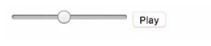

---
O metrônomo um dispositivo que deixa uma batida constante e ajuda os músicos a manterem um ritmo quando estão treinando. Esse ritmo pode aumentar ou diminuir de acordo com a escolha do músico. 

Teremos um HTML simples, e primeiro vamos criar um input type range para gerar uma barra que será onde vamos controlar a velocidade do nosso metrônomo. Nele conseguimos colocar qual o valor mínimo e qual o valor máximo. Vamos pegar o do google como exemplo, o mínimo será 40 e o máximo 218. Um value inicial e um ID para conseguirmos recuperar este valor. 

Em seguida, vamos colocar o áudio que será tocado _(no meu caso tenho um clap.wav e um botão play para controlar o metrônomo)._

```jsx {numberLines: true}
<html>

    <head><tittle>Metronomo</tittle></head>
    <body>
        <input type="range"  min="40" max="218" value="40" id="bpm"/>
        <audio src="clap.wav"></audio>
        <button id="play">Play</button>
    </body>
<html>
```

Ele ficará assim: 

 

Também é interessante colocarmos antes do input um H1 com o número inicial de batida que está configurado.

```jsx {numberLines: true}
<h1>40bpm</h1>
```

Feito isso, podemos começar a adicionar um pouco de comportamento. Vamos colocar o script no corpo do HTML mesmo, pois a intenção no exemplo é só demonstrar como poderíamos reconstruir o metrônomo. 

Toda vez que trocar o valor do range tem que ser trocado o que está escrito em H1. Então vamos pegar o BPM e o H1. Toda vez que o BPM mudar, ou seja, dar um change, o h1 tem que mudar também. Lembrando que essa técnica de colocar todos os seletores em cima é chamada de cash. 

Primeiro faremos um teste com um valor fixo criando uma função que faz o play. Vamos chamá-la de tick e um intervalo fixo, que em sequência vamos resolver. 

Nessa função tick, temos que pegar o áudio

```jsx {numberLines: true}
<script>
    const bpm = document.getElementById('bpm')
    const h1 = document.querySelector('h1')
    const play = document.getElementByld('play')
    const.audio = document.querySelector('audio')
    let currentBpm = 40
    function tick(){
        audio.currentTime= 0
        audio.play()
    }
    bpm.addEventListener('change', function(){
        h1.innerHTML = this.value + ' bpm'
        currentBpm = parseInt(this.value)
    })
    play.addEventListener('click', function(){
        const timer = setInterval(tick, 100)
    })
    </script>
```

  Agora vamos pensar um pouco: Se precisamos ter 40 batimentos por minuto e o minuto tem 60 segundos, 60 segundos tem 60 mil milissegundos, temos que distribuir 40 batidas dentro de 60 mil, então vamos dividir isso no valor do Bpm, ficando assim:

```jsx {numberLines: true}
play.addEventListener('click', function(){
    const timer = setInterval(tick, (60\*1000)/currentBpm)
})
```

  Precisamos agora de uma forma para desligar essa batida, para isso vamos usar declarar o let isPlaying, o timer, e um if para, caso ele estiver tocando, darmos um clearInterval nesse timer.

```jsx {numberLines: true}
<script>
    const bpm = document.getElementById('bpm')
    const h1 = document.querySelector('h1')
    const play = document.getElementByld('play')
    const.audio = document.querySelector('audio')
    let currentBpm = 40
    let isPlaying = false
    let timer = null
    function tick(){
        audio.currentTime= 0
        audio.play()
    }
    bpm.addEventListener('change', function(){
        h1.innerHTML = this.value + ' bpm'
        currentBpm = parseInt(this.value)
    })
    play.addEventListener('click', function(){
        if(isPlaying){
            clearInterval(timer)
        } else {
            const timer = setInterval(tick, (60\*1000)/currentBpm)
        }
        isPlaying = !isPlaying
    })
</script>
```

  Uma vez que estartamos o timer, ele começa a tocar. Ao clicar novamente, ele para, pois carrega na página com valor null. Ao clicarmos, damos um valor para ele e clicando de novo ele cai no isPlaying = !isPlaying que faz ele voltar a Null. Chamamos isso de toggle. 

Também podemos trocar o texto do botão para play caso esteja tocando e Stop para quando estiver parado. Perceba que, ao apertar o play, ele começa a tocar apenas no próximo tick, pois o setInterval demora esse tick. Podemos fazer ele começar já com esse tick.

```jsx {numberLines: true}
play.addEventListener('click', function(){
    if(isPlaying){
        play.innerHTML = 'Play'
        clearInterval(timer)
    } else {
        tick()
        play.innerHTML = 'Stop'
        const timer = setInterval(tick, (60\*1000)/currentBpm)
    }
    isPlaying = !isPlaying
})
```

  Para esse valor atualizar sempre que mudamos o range, temos que fazer um if, que vai limpar o intervalo e começar um novo valor baseado no cálculo.

```jsx {numberLines: true}
bpm.addEventListener('change', function(){
    h1.innerHTML = this.value + ' bpm'
    currentBpm = parseInt(this.value)
    if(isPlaying){
        clearInterval(timer)
        timer = setInterval(tick, (60\*1000)/currentBpm)
    }
})
```

Com isso, acabamos de construir um metrônomo.   

Essa é uma ideia do que se pode construir com javaScript e HTML. Algumas outras ideias faremos posteriormente. 

Confira o passo a passo em vídeo: 

<div class="embed-responsive embed-responsive-16by9 mb-4">
  <iframe class="embed-responsive-item" src="https://www.youtube.com/embed/9M7OY47OFzg" allowfullscreen></iframe>
</div> 

Curta o [DevPleno no Facebook](https://www.facebook.com/devpleno), [inscreva-se no canal](https://www.youtube.com/devplenocom) e não se esqueça de cadastrar seu e-mail para não perder as novidades. Abraço!