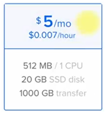
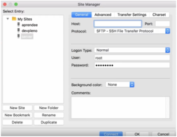
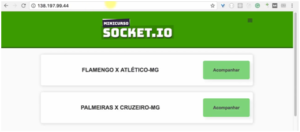
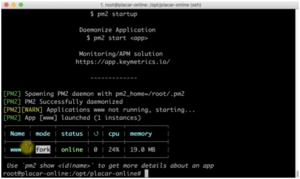
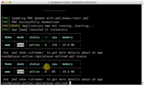

---
Chegamos à última etapa do nosso Minicurso de Socket.IO. Nessa aula, nós vamos colocar o projeto no ar para que você possa utilizá-lo como um projeto de portfólio e também mostrar as atualizações em tempo real para um potencial cliente. Além disso, eu vou mostrar como a gente pode deixar ele mais resiliente a falhas, como podemos gerar auto scalling, como aumentar a disponibilidade desse projeto. Além disso, vamos falar sobre outras melhorias que são muito importantes quando colocadas em produção. 

A primeira coisa é que vamos colocar o projeto para rodar no digital ocean, se você ainda não colocou nada no ar, ele é a melhor experiência para fazer isso porque ele é bastante simples e também barato, custa em torno de 5 dólares por mês por uma máquina que tem 512mb de ram, então se você for rodar um site de portfólio já é o suficiente. 

Eu já estou logado na minha conta, nela já tenho o cartão de crédito atrelado então já consigo criar um droplet aqui sem nenhum problema, eu aconselho a entrar em digitalocean.com e colocar os seus dados bancários também porque eles vão pedir. 

Vou dar um create Droplet. Uma coisa que é muito legal do digital ocean é que podemos começar uma máquina do zero, instalar o node e etc, ou ir em One-click apps e escolher uma máquina já preparada para isso, ali  já tem o Node em uma versão boa, que é a 6.10.3 e no Ubunto 16.04. Então eu vou clicar em NodeJS 6.10.3: 

 

E no tamanho da máquina eu vou escolher a de 5 colares: 



Eu já rodei aplicações production read e, em uma máquina de 10 dólares. tivemos 100 conexões simultâneas no Socket.IO, então não é uma escala muito grande, mas já deu para medir bastante e não teve quase nada de uso de memória. 

Quando trabalhamos em escala, pensamos exatamente isso, máquinas menores, mas trabalhando juntas, com isso conseguimos ligar e desligá-las de maneira mais satisfatória, então se você tiver um pico de acesso é possível aumentar o número de máquinas e diminuir caso caia o número de acesso. 

Em seguida, escolhemos qual a região que queremos, eles não têm na América do Sul, então obviamente eu deixo no padrão de New York, não mexo em mais nada, apenas ativo o monitoramento. 

 

E no nome vou colocar  placar-online. 

Em seguida vou dar um Create (o legal do digital ocean é que ele é muito rápido para criar). Terminando, ele vai enviar um email com os dados do servidor, nome de usuário e senha. 

Vamos fazer alguns testes, primeiro precisamos acessar a máquina com o ssh primeiro para poder depois enviar os arquivos, então vamos copiar o ip -  no caso do Mac, a gente consegue acessar o ssh direto. No caso do Windows, vou mandar um e-mail para você de como fazemos esse acesso usando o putty. 

Se você estiver utilizando o comander no Windows, é possível fazer da mesma forma que vamos fazer agora. 

Vamos lá, primeiro damos o comando:

```jsx {numberLines: true}
SSH root@IpDoServidor
```

Lembrando que é muito importante que coloquei **root@**, porque senão ele vai tentar logar com o usuário da sua máquina. Em seguida, ele pede a senha (basta só colocar a senha, ele irá pedir para trocar a senha no primeiro acesso). 

Agora já estou no placar online, vamos **em cd/opt/** e aqui já temos uma pasta digital ocean, vamos criar outra com **mkdir placar-online** e dar um cd nela. 

Por enquanto, essa parte eu vou parar por aqui e vou abrir o fileZilla que será um processo igual para os dois, tanto Mac quanto Windows e colocar o ip do meu servidor, login root e senha: 

 

Agora irei na mesma pasta que eu estava no shell, que é a /opt/, dentro dela temos o placar online, vamos fazer o upload dos nossos arquivos dentro dessa pasta, mais especificamente as pastas **bin, data, public, routes, views** e os arquivos **package.json, app.js e yarn.lock**. A única pasta que não vamos subir é a node\_modules. Sempre que formos instalar dependências, temos que fazer isso dentro da máquina que vamos rodar, isso é uma boa prática porque às vezes têm alguns módulos do node que são compilados de acordo com a plataforma. 

Voltando ao shell, depois que todos os arquivos forem upados, vou dar um **npm install**  apenas para instalar as dependências. 

Agora já temos o projeto rodando, vamos checar se ele está rodando realmente:

```jsx {numberLines: true}
node bin/www
```

como ele está com a saída vazia vamos fazer:

```jsx {numberLines: true}
PORT= 80 npm start
```

Agora vou abrir o navegador e verificar se está realmente rodando: 

 

Está rodando perfeitamente! Perceba que eu coloquei PORT= 80, isso significa que eu defini uma variável de ambiente antes de iniciar o servidor. Não seria interessante deixar o shell aberto para que nosso serviço fique online, então vamos fazer o seguinte:

```jsx {numberLines: true}
npm install -g pm2
```

O pm2 é um pacote do npm que permite startar serviços como serviços do linux. 

Agora vou dar um **vi start.json**, quando nós vamos startar uma aplicação pelo pm2 temos que definir para ele algumas variáveis de ambiente, igual o port que colocamos logo acima, porque ele não reconhece automaticamente essas variáveis do ambiente:

```jsx {numberLines: true}
{
    "script": "bin/www",
    "env":{
    "PORT": 80,
    "NODE\_ENV": "production"
}}
```

Então vou criar um Json com um script que é um env com duas propriedades dentro. 

Agora faremos  **pm2 start start.json**, perceba que ele já startou o próprio json: 

 

A vantagem é que pelo pm2 eu consigo ver como ele está utilizando o **pm2 status** 

 

Uma dica adicional: se quiser parar o serviço, digite:

```jsx {numberLines: true}
pm2 stop all
```

Se alterar o json com a configuração de início, ele não vai funcionar, então temos que fazer um **pm2 delete** para ele apagar o processo e depois sim startar o serviço, senão ele vai pegar sempre o cache. Então aqui já temos o nosso projeto rodando perfeitamente para poder usar como portfólio e com isso chegamos ao fim do nosso minicurso sobre Socket.IO. 

Podemos deixar ainda melhor para produção esse nosso serviço, usando escalabilidade, mas isso eu vou deixar como surpresa para você que vai participar do nosso FULLSTACK ACADEMY, se você ainda não se cadastrou aproveite agora e clique no link: [https://www.devpleno.com/fullstackacademy/](https://www.devpleno.com/fullstackacademy/) e conheça mais sobre nosso evento. 

<div class="embed-responsive embed-responsive-16by9 mb-4">
  <iframe class="embed-responsive-item" src="https://www.youtube.com/embed/wtF5Cv_-SyU" allowfullscreen></iframe>
</div> 

Curta o [DevPleno no Facebook](https://www.facebook.com/devpleno), [inscreva-se no canal](https://www.youtube.com/devplenocom) e não se esqueça de cadastrar seu e-mail para não perder as novidades. Abraço!