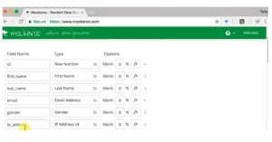
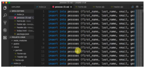

---
Essa dica é bem curtinha, porém muito útil: como podemos gerar um banco de dados de teste para uma aplicação. A ferramenta que vamos utilizar se chama Mockaroo, que consegue gerar dados falsos para injetar em uma aplicação. 

 

O interessante dessa ferramenta é que temos várias classes de dados e conseguimos definir quantas linhas e qual o formato, por exemplo, um JSON, SQL, Excel e por ai vai. 

  

No caso do SQL você pode gerar um banco de teste baseado no seu SQL, por exemplo, eu tenho um cadastro de pessoas e com os campos eu não quero por exemplo o ID e baixar os dados que funciona muito bem: 
 
 
 
Com isso eu consigo gerar uma massa de dados para testar, e o mais interessante é que se pode formatar, então quando por exemplo você quer usar um date é possível formatar como quiser: 
 
 
 
Isso ajuda muito quando queremos gerar essa massa de dados para teste e não quer utilizar o faker que é um outro módulo que utilizei para vocês. Se vocês quiserem adicionar mais de mil eu recomendo que insiram esses mesmos registros varias vezes para não precisar pagar, ele custa 50 dólares por ano para 100 mil linhas e 500 dólares para 10 milhões de linhas. 
 

  <iframe class="embed-responsive-item" src="https://www.youtube.com/embed/dCpXvk7Pngc" allowfullscreen></iframe>

 

Curta o [DevPleno no Facebook](https://www.facebook.com/devpleno), [inscreva-se no canal](https://www.youtube.com/devplenocom) e não se esqueça de cadastrar seu e-mail para não perder as novidades. Abraço!