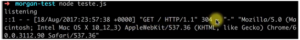
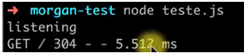

---
O hands-on de hoje é sobre o Morgan, que é uma forma de logar ou mostrar quais requisições estão chegando em nosso servidor HTTP, seja ele feito no Express ou em Node puro utilizando o módulo HTTP. 

A primeira coisa que temos que fazer é adicionar as dependências:

```jsx {numberLines: true}
yarn add express morgan
```

Eu já tenho um arquivo teste criado e vou começar a importar o que precisamos:

```jsx {numberLines: true}
const express = require('express')
const morgan = require('morgan')
const app = express()
app.get('/', (req, res) => {
    res.send('olá DevPleno')
})
app.listen(3000, ()=> console.log('listenning'))
```

Agora vamos colocar o Morgan como um Middleware e ele vai interceptar toda a requisição que chegar:

```jsx {numberLines: true}
app.use(morgan('combined'))
```

Perceba que, ao dar F5 na página, ele traz as informações: 

 

Isso é muito legal porque no Apache já temos isso, e se estivermos rodando isso na Amazon, temos a possibilidade de conseguir recuperar esses dados. Temos uma outra versão que é o Tiny:

```jsx {numberLines: true}
app.use(morgan('tiny'))
```

 

Nele temos um retorno mais simples, o método, saída e tempo de resposta. Ainda temos uma terceira forma, que é um padrão personalizado:

```jsx {numberLines: true}
app.use(morgan(':method :url :response-time'))
```

 

Lembrando que, pela Amazon, você pode guardar isso enviando para o S3. Indo para lá, você pode guardar essas informações por muito tempo. 

Essa é a ideia para gerar dados toda vez que a gente recebe uma requisição no Express, isso é bastante útil, é algo que já existe no Apache, mas temos que adicionar como Middleware no Express e assim configurar da maneira que queremos. 

<div class="embed-responsive embed-responsive-16by9 mb-4">
  <iframe class="embed-responsive-item" src="https://www.youtube.com/embed/19HkfrtUm38" allowfullscreen></iframe>
</div>

Curta o [DevPleno no Facebook](https://www.facebook.com/devpleno), [inscreva-se no canal ](https://www.youtube.com/devplenocom)e cadastre seu e-mail para não perder nenhuma novidade. Deixe suas dúvidas e sugestões nos comentários. Abraço!