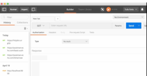
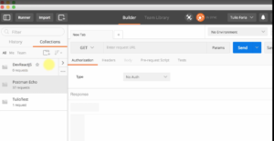
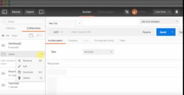
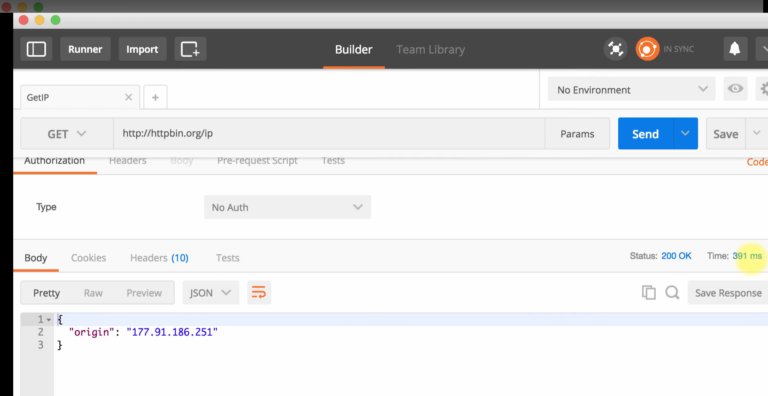
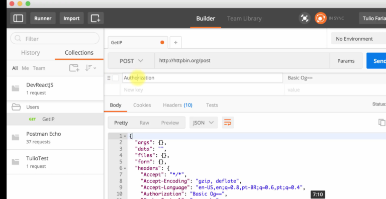
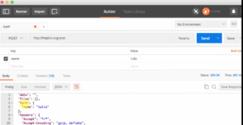

---
O Postman é uma ferramenta indispensável para o desenvolvimento de aplicativos API, principalmente Rest API, pois ele é um client para uma API em Rest. Existem outras ferramentas para isso, mas o Postman é o mais conhecido no mercado. 

O  primeiro ponto interessante é que o Postman é uma extensão do Google Chrome, então ele segue uma tendência de aplicações que são desenvolvidas como extensões, e à medida com que elas vão tendo propriedades a mais, você pode adicionar como um aplicativo na sua máquina. 

Primeiro precisamos criar uma conta para ser possível salvar links. Você vai encontrar uma tela parecida com essa: 

 

Como eu já havia criado e feito alguns testes, já tem um histórico do lado, mas o seu estará vazio. 

Perceba que existe o History e o Collections. No Collections, há alguns exemplos de como fazer algumas requisições, como mudar o tipo de request, mas também é possível criar uma Collection nossa. 

   

Isso nada mais é que um conjunto de requisições que criamos. Por exemplo, suponhamos que vou criar um projeto DevReactJS, eu crio então uma Collection e dentro da Collection é possível criar uma pasta (folder). 

 

Podemos criar, por exemplo, uma pasta Users e salvar a requisição dentro. 

Vou colocar em GET  [http://httpbin.org/ip](http://httpbin.org/ip), ir em Save (ao lado de Send), Save as _(podemos dar um nome, como GetIP),_ escolher o projeto e a pasta que queremos e pronto. Note que vai ficar salvo dentro da pasta, o que é muito legal pois posso compartilhar depois, clicando em share, collection link. Assim, posso mandar o link para outra pessoa testar o sistema que estou fazendo. 

Se for uma API, você pode mandar um exemplo de API para o usuário e ele precisa apenas mudar a parte de autenticação. Mas caso você mesmo queira trocar a autenticação, basta ir em Authorization, nele você diz qual o tipo de autenticação está usando. Lembrando que sempre que fizer algo em Authorization precisa dar um update request para atualizar os Headers correspondentes. 

Se clicarmos em Send ele irá executar e retornar com o status. No nosso caso deu OK, tempo 391ms, todos os headers que tivemos e em body é possível visualizar como Pretty, Raw e Preview. Veja o exemplo abaixo: 

Vamos criar mais uma requisição, mas dessa vez um POST utilizando o link ([http://httpbin.org/post](http://httpbin.org/post)), mas podemos criar todos os métodos do HTTP. 

 

Vamos criar mais uma requisição, mas dessa vez um POST utilizando o link ([http://httpbin.org/post](http://httpbin.org/post)), mas podemos criar todos os métodos do HTTP. 

 

Perceba que o POST suporta body, então é possível mandar dados para ele. Vou mandar um name e enviar Tulio: 

O form retorna com o valor que coloquei. 

Também podemos enviar um arquivo apenas mudando o text para file. 

Temos o environment, que cria alguns ambientes e podemos customizar os requests baseados neles, mas basicamente, para mim, já é possível usar boa parte apenas usando collections e requisições. 

Confira todos detalhes no vídeo: 

  <iframe class="embed-responsive-item" src="https://www.youtube.com/embed/rI9rhM6iJoI" allowfullscreen></iframe>

Deixe suas dúvidas e sugestões nos comentários. Curta o [DevPleno no Facebook](https://www.facebook.com/devpleno), [inscreva-se no canal](https://www.youtube.com/devplenocom) e não se esqueça de cadastrar seu e-mail para não perder as novidades. Abraço!