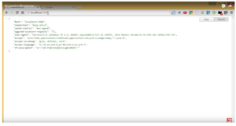
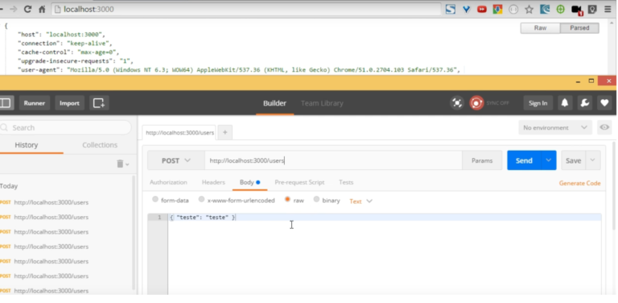

---
Nos posts anteriores já falamos sobre back-end, front-end, como eles se comunicam através de uma requisição, e agora você verá um exemplo prático de um request e um response. 

Vamos usar o NodeJS, mas não é obrigatório focar nisso, pois depois vou falar exclusivamente sobre ele. Toda vez que você entra em um site, como o google, está fazendo um GET no [Google](https://www.google.com/). 

Como checar se isso está realmente acontecendo? 

No caso do Windows, apertamos F12 usando o Chrome e então irá aparecer esta aba Network: 

 

Perceba que temos várias abas, isso é uma barra de desenvolvimento. A medida que formos avançando iremos passar por algumas delas. O importante para agora é o Network, aperte o F5 e irá aparecer muitas requisições: 

 

Se você clicar em alguma delas, é possível ver tudo sobre ela, e uma das coisas é o request method do tipo GET, qual o servidor, etc. Temos também o response reader logo a baixo: 

 

No caso do GET, não temos um Request Body, mas temos um Response Body, que fica ao lado de preview. Lá seria a pagina inicial do google já retornada para o usuário. Agora vamos fazer o seguinte: quando vier um GET em '/' irei retornar todos os GET's da requisição e os dados de resposta em uma function req e res, pegamos o requests da requisição e devolvo ao cliente.

```jsx
var express = require ('express');
var app express();
app.get('/', function (req, res){
    //res.send('Esta é uma requisição GET.');
    //res.send(req.query);
    res.send(req.headers); 
});
```

Quando rodarmos o exemplo irá aparecer o seguinte: 

 

Mostrando todos os Headers que eu solicitei. 

Lembrando que, quando temos um request/response, sempre temos um cabeçalho para cada. Dependendo da requisição. podemos ter o body ou não. Também há outros tipos de requisição, como é o caso do POST. Nele podemos fazer a mesma coisa, porém com uma diferença: não conseguimos fazer no mesmo nível do GET pelo navegador. Vou mostrar agora o Postman, que permite que a gente faça um POST. Vamos então fazer um POST em /users:

```jsx
var express = require ('express');
var app express();
app.post('/users', function(req,res){
    res.send(req.headers);
    req.on('data', function(chunk){
        //res.send(chunk);
    });
});
```

Vamos mandar para http://localhost:3000/users o tipo de requisição, no caso o POST, e um raw, ou seja, um texto puro. 

 

Em Text, selecionamos JSON e ele já troca o cabeçalho de solicitação para JSON. Apertamos o Send, e  a resposta que vem são os cabeçalhos do request. 

 

Note que o content-length retornou 20 bytes, pois estou enviando 20 bytes de dados, diferente do anterior onde não estou enviando nada. Lembrando que no post eu tenho o body da minha requisição. O básico de uma aplicação WEB sempre funciona dessa forma, então o front-end faz uma request e recebe uma resposta. 

Assista ao vídeo da explicação: 

<div class="embed-responsive embed-responsive-16by9 mb-4">
  <iframe class="embed-responsive-item" src="https://www.youtube.com/embed/2Mv2ayJ3euA" allowfullscreen></iframe>
</div>

Deixe suas dúvidas e sugestões nos comentários. Curta o [DevPleno no Facebook](https://www.facebook.com/devpleno), [inscreva-se no canal](https://www.youtube.com/devplenocom) e não se esqueça de cadastrar seu e-mail para não perder as novidades. Abraço!