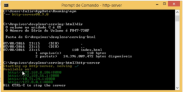
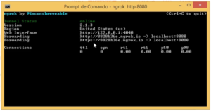
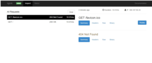

---
Nesta dica, vou mostrar como servir arquivos estáticos de forma simples, além disso, como expor um servidor local de testes para a internet e ainda utilizando uma conexão segura (HTTPS).

Pressupondo que a gente já tenha o NodeJS e o NPM instalado vamos fazer o seguinte no cmd:

```jsx
npm install -g http-server
```

Ele vai instalar o HTTP server, que é mais ou menos parecido com o APACHE, porém mais simples porque podemos servir qualquer pasta, geralmente de forma temporária e não startado como serviço.

Então vamos lá. Já estou na minha pasta, na qual tenho o HTML, e vou colocar:

```jsx
http-server
```

Ele me mostra alguns endereços, disponibilizando para um servidor e ouve as placas de rede. 

 

Vamos pegar o primeiro, abrir uma aba nova no browser e mandar rodar. A partir daí, estamos acessando via um servidor. Algumas API's do JavaScript e HTML eu já conseguiria acessar por estar no servidor, mas algumas delas eu preciso estar em uma conexão segura para esse endereço, e como faço isso? 

Uma das maneiras que eu acho interessante é usando uma ferramenta chamada [ngrok](ngrok.com/download). É um arquivo zip com um .exe dentro. Podemos colocar ele dentro de uma pasta e colocar a pasta no path. No meu caso, sempre coloco ele na área de trabalho, abro outro CMD e faço:

```jsx
ngrok http 8080
```

8080 representa a porta que estamos utilizando. Com isso, ele libera dois endereços, um https e um http, abrindo um túnel pela internet. 



Se copiarmos o endereço https e colar no browser, a conexão para o mesmo arquivo vai ser com https, assim podemos testar muito mais coisas da API do HTML5. 

Uma vantagem do ngrok é que como ele é um túnel, o endereço vai estar disponível na internet, logo você pode enviar esse endereço para seu cliente por exemplo, que vai acessar normalmente.  

Outra vantagem é quando você for testar Webhook. Vamos supor que você vá integrar com um gateway de pagamento, eles geralmente oferecem o Webhook, caso aconteça alguma coisa no pagamento, ele faz uma requisição em seu servidor falando que algo aconteceu. Uma das coisas que a nossa empresa faz bastante é definir a URL do ngrok com uma URL do Webhook, então mandamos para o pagseguro e quando houver uma alteração no status do pagamento, mandamos uma requisição e meu sistema, rodando na minha máquina, consegue receber sem eu precisar fazer configuração nenhuma de roteador porque o ngrok está fazendo o túnel dessa aplicação. 

Uma coisa interessante: quando abrimos a interface no prompt, perceba que existe um web interface. Se abrirmos esse endereço, temos acesso a esse painel: 

 

Nele são mostradas todas as requisições que foram feitas naquele endereço, o código em summary,os headers que foram enviados e por aí vai. 

Quando formos refazer este teste com o Webhook, é possível reproduzi-lo apenas apertando em Replay. Já que o Webhook acontece uma vez só, por exemplo em uma transação de teste que eu fiz, chegou no ngrok e foi passado para a aplicação, vamos supor que você cometeu um erro na aplicação e ela não processou, podemos vir aqui e mandar dar um replay, assim ele vai fazer a requisição para o servidor de testes e você vai conseguir recriar o teste. 

Confira a dica em vídeo: 

<div class="embed-responsive embed-responsive-16by9 mb-4">
  <iframe class="embed-responsive-item" src="https://www.youtube.com/embed/n_hWce2qxN4" allowfullscreen></iframe>
</div>

Curta o [DevPleno no Facebook](https://www.facebook.com/devpleno), [inscreva-se no canal](https://www.youtube.com/devplenocom) e não se esqueça de cadastrar seu e-mail para não perder as novidades. Abraço!