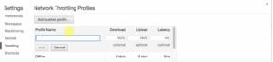
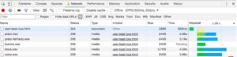

---
Hoje vou dar uma dica para de algo muito útil e simples de ser feito, mais especificamente de como podemos testar nosso site ou aplicação web restringindo a conectividade, ou o quanto o usuário consegue baixa de dados para simular, por exemplo, se o usuário está suando um 3G e como nossa aplicação vai se comportar nesse cenário. Confira agora o passo a passo de como simular uma conexão lenta. Esse é um teste muito importante para saber se nossa interface está dando feedback necessário e se está correndo de maneira que o usuário tenha a melhor experiência do aplicativo. Vou abrir o exemplo do beatbox que tinhamos feito anteriormente só para saber como vai ser feito o carregamento. Na área superior direita do browser (estou usando o chrome) vou em more tools e em seguida developer tools (no windows é só apertar F12); 

Se ir em network, há uma aba chamada No throttling: 

 

Isso significa que não estamos restringindo a conectividade. Nesse sentido, o Chrome vai baixar o mais rápido que ele conseguir. 

Ao clicar, percebemos que há vários presets: 

 

Temos offline que não passa anda, GPRS que tem uma latência de 500ms, 50kb/s de download e 20kb/s upload e por vai. Vamos pegar, por exemplo, GPRS e dar um F5 na nossa página. Note que ele demora mais para responder. 

No meu caso, a página foi carregada em 7 segundos. Se remover a restrição, ela é carregada em 771ms. Isso é muito legal para testar pré loading. No exemplo do beatbox, não fizemos um pré loading dos áudios e se o usuário estiver utilizando no celular, isso pode afetar bastante. Temos, então, que verificar se a interface está dando a resposta adequada para o usuário. Outra coisa bastante importante: Às vezes, restringir até mais que isso. Vamos em 'Add...' e podemos adicionar um custom profile. 

Por exemplo, na minha máquina, tenho uma conexão chamada 'quase nada' com download e upload de 1kbps e latência de 500ms, fiz isso para testar caso a pessoa tenha acesso, mas seja quase nenhum. Com isso, é possível ver se a interface está responsiva e interessante para o usuário. Podemos ainda desligar indo no checkbox do offline para ver se a aplicação tem condições de se restabelecer. Tenho trabalhado ultimamente para que as aplicações continuem funcionando mesmo offline, então isso é uma ótima forma de testar. Quando você for testar, por exemplo, um projeto em React, olhe se o bundle não ficou muito grande, isso ajuda a perceber como o nosso usuário vê nosso sistema na hora de utilizar.   

Confira o vídeo-tutorial: 

  <iframe class="embed-responsive-item" src="https://www.youtube.com/embed/ICG31XO7GS8" allowfullscreen></iframe>

Curta o [DevPleno no Facebook](https://www.facebook.com/devpleno), [inscreva-se no canal](https://www.youtube.com/devplenocom) e não se esqueça de cadastrar seu e-mail para não perder as novidades. Abraço!