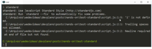
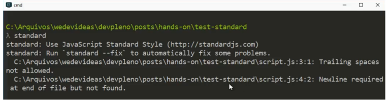
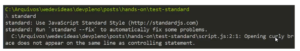

---
O módulo Standard é uma ferramenta bastante útil no nosso dia a dia, ele aplica algumas regras para você manter seu código fonte. Por exemplo, se você vai fazer um 'if', tem que deixar um espaço porque facilita a leitura:

```jsx
if (i === 1) {
    }
```

Com o tempo você sente que seu código precisa melhorar, tanto em performance quanto em organização. Quando começamos temos que resolver um código, depois de um tempo isso já não é o suficiente. Precisa ser feito de forma que outras pessoas entendam e que fique bem organizado, que é algo que levo pra minha carreira hoje, procuro resolver o problema da melhor forma possível. Uma das formas que temos para aumentar a qualidade de um código é mantendo um padrão de escrita. Em Java, é muito comum utilizarmos o Java Cult, em JavaScript temos algumas opções como o Standard. 

No caso do Standart, ele tem uma ferramente que checa o código. Para usar, primeiramente tem que dar um npm:

```jsx
npm install -g standard
```

Quando você roda o módulo, ele procura todos os arquivos JS dentro do seu diretório atual e vê se está faltando alguma coisa, por exemplo no meu ele achou alguns erros: 

 

Então o 'i' em nosso 'if' não foi definido, com isso conseguimos pegar um bug antes mesmo dele acontecer, então vamos resolver o primeiro bug:

```jsx
let i = 0
if (i === 1) {
}
```

Ao rodar, percebam que já diminuiu um bug: 

 

Agora temos um espaço vazio na linha 3

```jsx
let i = 0
if (i === 1) {
console.log(1)
}
```

E por fim, adicionar uma nova linha no final do arquivo. Quando fazemos isso não retorna nenhum erro no nosso código. Se eu der um 'tab' a mais, por exemplo, no console.log, ele vai retornar que está identado errado. 

Uma coisa que dá bastante discussão é onde colocar a abertura da chave. Se você colocar na linha de baixo, ele irá dar um erro:

```jsx
if (i === 1) {
    console.log(1)
}
```

 

Porque temos que colocar o nosso curly brace na mesma linha do controlador. Se você criar um projeto e seguir esse padrão, as chances do seu código ter menos erros é maior, além disso, ele fica bem mais legível.  

Ele também tem algumas coisas de lint também, o próprio Standard utiliza o ES Lint para resolver isso. A ideia é que você comece a utilizar algum padrão de código em JavaScript, em todas as linguagens tem alguma recomendação para utilizar as melhores práticas. 

Confira o hands-on em vídeo: 

<div class="embed-responsive embed-responsive-16by9">
  <iframe class="embed-responsive-item" src="https://www.youtube.com/embed/H005spSyxeA" allowfullscreen></iframe>
</div>

Curta o [DevPleno no Facebook](https://www.facebook.com/devpleno), [inscreva-se no canal](https://www.youtube.com/devplenocom) e não se esqueça de cadastrar seu e-mail para não perder as novidades. Abraço!