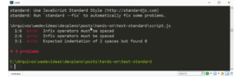

---
Para complementar o hands-on que fizemos sobre [Standard](https://www.devpleno.com/standard-parte-1/), vou passar mais duas dicas sobre a ferramenta. A primeira é uma biblioteca que se chama Snazzy e a segunda é uma forma de automatizar a formatação do código fonte. 

Imagine o seguinte, você tem um código gigante que precisa passar para o Standard, o que podemos fazer? Vamos lá:

```jsx
standard --fix script.js
```

Com isso ele já corrigiu o arquivo fonte. Podemos utilizar para formatar automaticamente, eu não uso tanto para formatar dependendo do arquivo porque eu gosto de corrigir para não errar novamente. O segundo módulo se chama Snazzy. Primeiramente vamos instalar:

```jsx
npm install -g snazzy
```

Se rodarmos Standard no nosso código, percebemos que é bem difícil de entender ou achar onde está o problema, então se fizermos:

```jsx
standard | snazzy
```

Ele vai organizar os erros da seguinte forma: 

 

Ele formata as saídas falando os problemas do código de forma organizada, então temos um erro na linha 1 no caracter 6, na linha 2 também, no caracter 6; e na linha 3, o caracter 1, todos eles explicando os erros. 

Eu geralmente uso o Snazzy, dou uma olhada no arquivo, se não for nada muito grave, uso o --fix para corrigir o arquivo. Recomendo que façam isso também, porque talvez alguma alteração pode atrapalhar seu código. 

Confira o vídeo: 

<div class="embed-responsive embed-responsive-16by9">
  <iframe class="embed-responsive-item" src="https://www.youtube.com/embed/ISVp1mlB1BA" allowfullscreen></iframe>
</div>

Curta o [DevPleno no Facebook](https://www.facebook.com/devpleno), [inscreva-se no canal](https://www.youtube.com/devplenocom) e não se esqueça de cadastrar seu e-mail para não perder as novidades. Abraço!