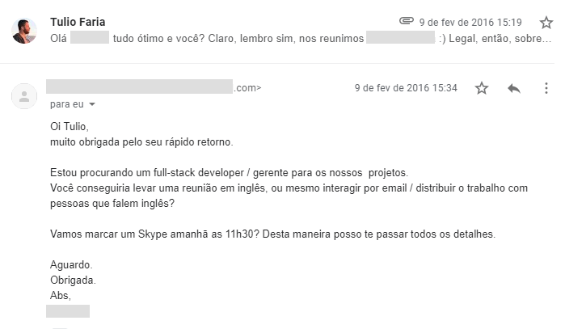
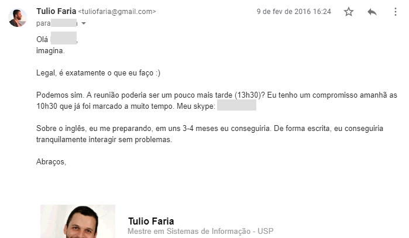
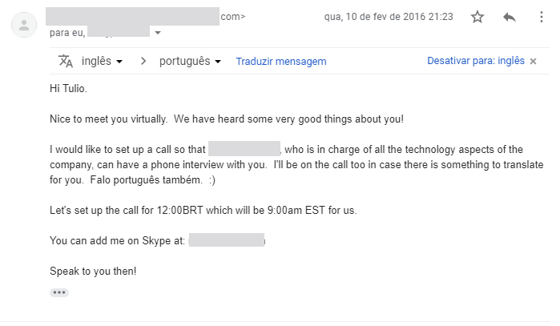

---

Geralmente, acredita-se que não… Afinal de contas, carnaval, feriado, festas, bebedeira, ninguém quer se preocupar com carreira ou trabalho. Não é verdade? 

Bom, pelo menos muita coisa mudou em minha carreira a partir de uma terça feira de carnaval. Estranho isso, né? 

Toda essa mudança na minha carreira começou dia 9 de fev de 2016, às 14h18 - também conhecida como terça-feira de carnaval. :) 

Só para entender o cenário, eu já estava com alguns problemas financeiros e durante o carnaval (sem dinheiro) estava explorando formas de mudar minha carreira - pois a situação estava ficando insuportável... 

Neste carnaval de 2016, eu estava buscando e explorando possibilidades de negócios e realmente empenhado em dar uma mudança financeira na minha vida. Perto desta época, comecei a considerar trabalhos remotos e já havia enviado meu CV para dezenas de vagas sem ter nenhuma resposta. Mas a minha intenção já estava setada. ;) 

Foi quando recebi o e-mail desta foto:  

   
Sim, uma pessoa que eu havia sido apresentado há 2 anos, lembrou-se de que eu poderia ajudá-la em um projeto. 

E apesar do e-mail estar em português, ela estava em Nova Iorque e precisava resolver um grande problema no projeto. Toda a negociação aconteceu durante a terça feira de carnaval e quarta-feira de cinzas. Ao final da quarta-feira de cinzas, eu estava contratado - com contrato assinado e tudo mais - e já tinha recebido um e-mail (em inglês) de um outro membro da equipe para falar com o CTO (eu havia sido contratado pela CEO). 
 
 

 
  Relembrando este acontecimento, eu consegui desconstruir vários pontos interessantes que gostaria de compartilhar com vocês:

**Network não acontece do dia para a noite!**

Eu conheci a pessoa 2 anos antes deste e-mail. Sim, 2 anos! E pasmem, quem me apresentou a ela foi um colega que havia estudado comigo 13 anos antes. Network é um jogo de longo prazo e tem que ser cultivado o tempo todo!

**Quanto você está comprometido com a mudança que quer?**

Eu queria uma mudança na minha carreira. Eu não sabia que ia acontecer no carnaval, mas mesmo assim, eu estava usando esse feriado para, de alguma forma, achar uma solução para a época. E isso me fez estar presente, disponível e apto a responder prontamente a uma oportunidade bastante interessante.

**Quanto você se coloca em risco?**

Uma preocupação da pessoa pelos e-mails sempre foi a comunicação em inglês. E mesmo não estando preparado, eu mantive a clareza de dizer que talvez não conseguiria mas que eu estaria preparado em um prazo determinado. Da última vez que você foi questionado sobre algo que não domina, você respondeu com um prazo para isso acontecer? No meu caso, respondi que em 3-4 meses eu iria conduzir/liderar uma reunião toda em inglês. Na época eu nunca havia feito isso, muito menos tinha conversado com alguém em inglês. Como eu sabia que 3-4 meses era o suficiente? Na verdade, o que eu sabia era que eu FARIA esse período ser o suficiente para alcançar isso. Independente do que acontecesse, eu ia dar o meu jeito. Sem desculpas! Durante o projeto, destravei meu inglês, aprendi a negociar e a resolver muitos problemas em equipes extremamente diversas. Mas o mais importante: descobri que eu era capaz de contribuir em projetos mundiais e o Brasil já não era mais o meu limite. Depois disso veio a Toptal e vários outros projetos de grande impacto no mundo e na minha carreira… Mas é interessante pensar que tudo começou com uma troca de e-mails no carnaval. E a minha reflexão aqui é: será que a mudança que você quer não está onde você menos espera? Será que você não poderia usar seu carnaval para aprender React ou estudar um tema que vai te proporcionar a mudança que você tanto quer para sua vida? Chega de desculpas! 

